# Assignment 2


# Mandelbrot Set Computation


# Nama: Zixuan Yao

# Student ID: 115010267


## Objective

This assignment requires to write two parallel version of the program using MPI and Pthread and compile and run the program based on Xlib in the cluster.


## Methods & Program Design

### MPI

#### Static

There is a Master processor controlling drawing the pattern, and all the other slave processors calculating the pattern. The job is distributed statically. The slaves will send the values back to the master every time they complete one column. The communication between master and slaves uses MPI library.


#### Dynamic

The basic idea is pretty much the same in dynamic version of MPI. There is a Master processor controlling task scheduling and pattern drawing, and all the other slave processors calculating the pattern. The job is distributed dynamically. The slaves will send the values back to the master every time they complete one column and ask for a new column from the master. The communication between master and slaves uses MPI library.

One more advanced version of dynamic scheduling is adopting the idea of chunk. Instead of sending one column at a time, several columns (chunk) are sent to the slaves simultaneously. It will reduce the communication time, but increase the workload imbalance. So, theoretically there will be a best chunk value for a certain size of the problem.

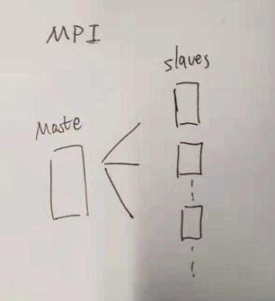


### Pthread

#### Static

Unlike MPI program, there is no Master thread in Pthread program, because Pthread is a share memory program. The job is distributed statically to each thread and every thread will calculate and draw the pattern. There is no communication between each other.


#### Dynamic

The basic idea is pretty much the same in dynamic version of Pthread. Three is no Master thread in Pthread program  and every thread will calculate and draw the pattern. However, The job is distributed dynamically to each thread by maintaining a global variable that documents the next column to be calculated. Whenever a thread is free, it will mutex lock the global variable and take its next job and change the global variable to the next value, mutex unlock it at last.

One more advanced version of dynamic scheduling is adopting the idea of chunk. Instead of sending one column at a time, several columns (chunk) are sent to the slaves simultaneously. It will reduce the communication time, but increase the workload imbalance. So, theoretically there will be a best chunk value for a certain size of the problem.

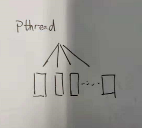


## Instruction & Results

### MPI

``` bash
[115010267@mn01 ~]$ mpicc -o mpiout_static MPI_static.c -lX11
[115010267@mn01 ~]$ mpicc -o mpiout_dynamic MPI_dynamic.c -lX11
[115010267@mn01 ~]$ mpirun -np 4 mpiout_static 100
 MAX_CALCULATE_ITERATION : 100
total time : 0.0738942
[115010267@mn01 ~]$ mpirun -np 4 mpiout_dynamic 100
 MAX_CALCULATE_ITERATION : 100
total time : 0.0357361
```

The argument 100 is the argument to indicate how many K you want to run in your program (change the program size).


### Pthread 

``` bash
[11/08/18]seed@VM:~/Downloads$ gcc -o pthread_dynamic Pthread_dynamic.c -lpthread -lX11
[11/08/18]seed@VM:~/Downloads$ gcc -o pthread_dynamic Pthread_dynamic.c -lpthread -lX11
[11/08/18]seed@VM:~/Downloads$ ./pthread_static 8 10
Num_Pthreads: 8, MAX_CALCULATE_ITERATION: 10
 Totaltime: 0.024651
[11/08/18]seed@VM:~/Downloads$ ./pthread_dynamic 8 100 10
Num_Pthreads: 8, MAX_CALCULATE_ITERATION: 100
 Totaltime: 0.036632
```

The argument 8 is the argument to indicate how many threads you want to create and the second argument indicates that how many K you want to run in your program (change the program size) like in MPI.

The last argument only in dynamic pthread is the argument to indicate how many chunk of tasks are going to be allocated to one threads at a time.


### Result

The colorful output figure will be:

K = 10

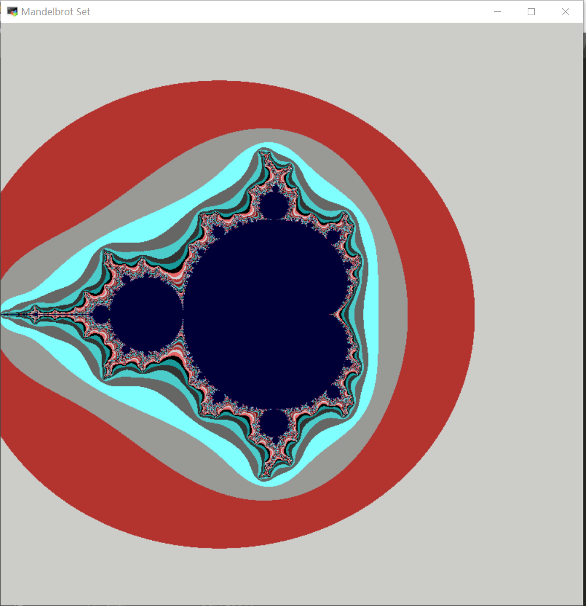

K = 100

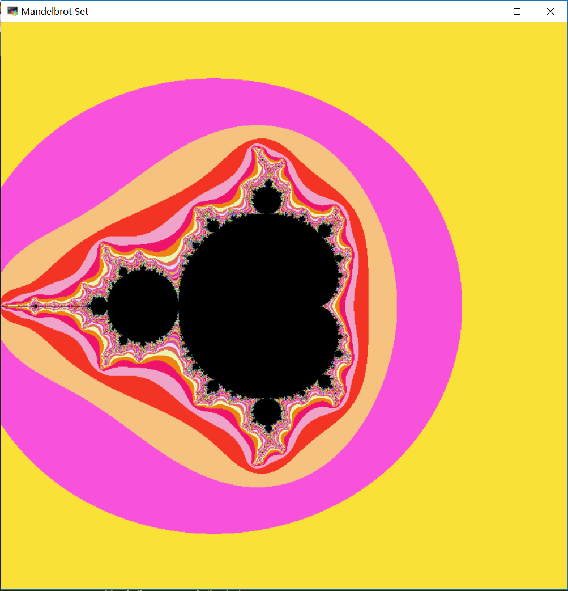

K = 1000

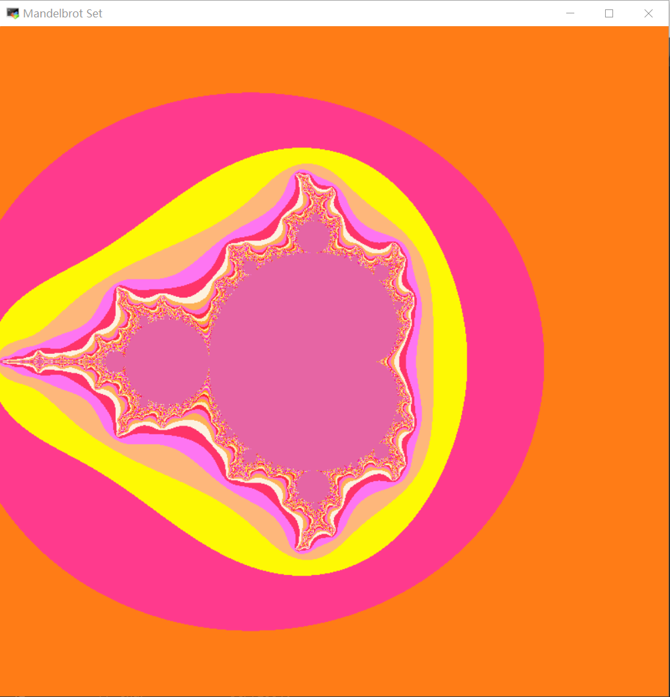

For different K, I draw different color to indicate.


## Performance Analysis

I test the program performance by running various problem sizes on different number of processors, the running time is collected in the following tables and figures. There are also several ways to enlarge the problem size, I select K because it has the most clear effect on the problem size, and it can also reflect the difference between the static program and dynamic program. The speed up factor is also calculated to see the improvement more clearly.


### MPI

#### Static

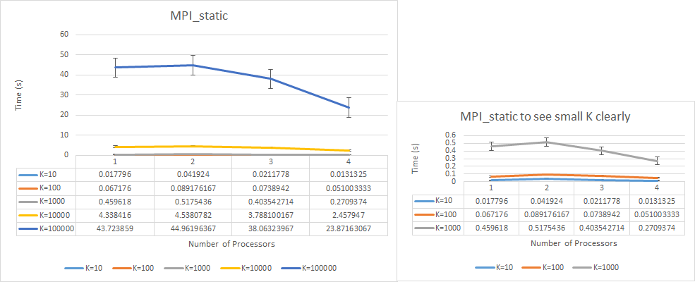

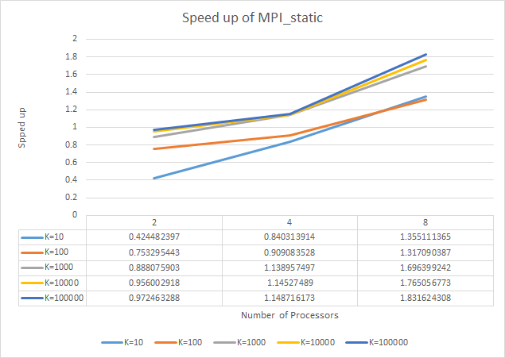


#### Dynamic

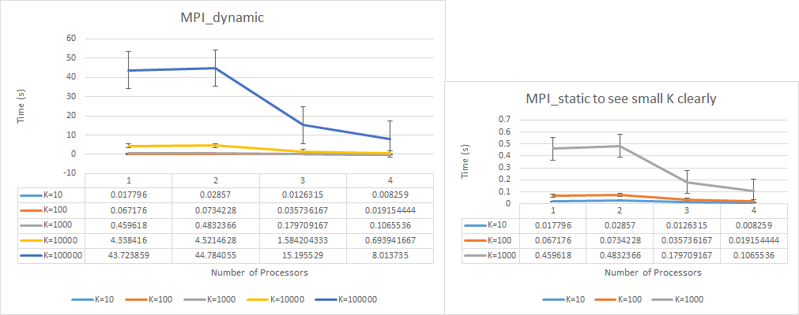

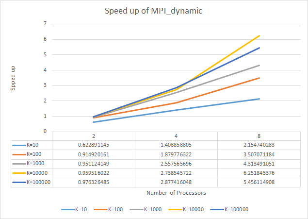


### Pthread

#### Static

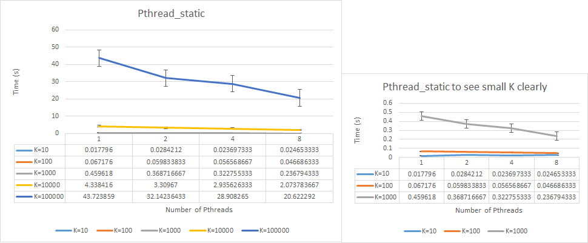

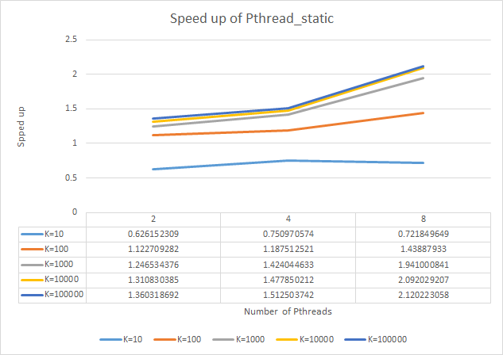


#### Dynamic

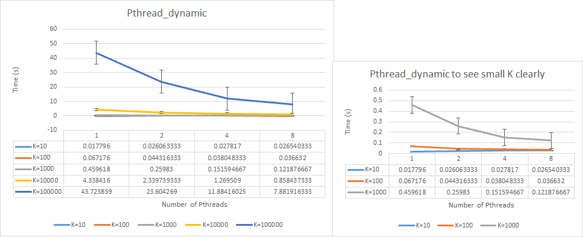


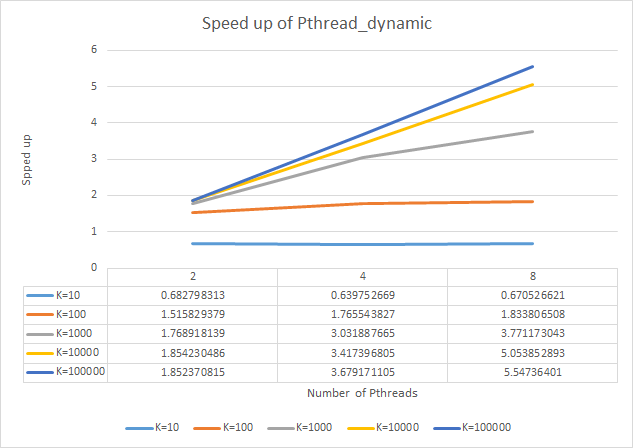


Based on the figures it can be easily observed that, the parallel program will have good performance when the problem size is large. And dynamic program won't have much difference compared with static program when the problem size is small, but will have significant improvement when the problem size becomes larger. 

Pthread will performance better when problem size is small, because Pthread shares memory, thus they don't have communication overhead, which counts a significant time in the total execution time of MPI when the problem size is small. That's why we can hardly get improvement when the problem size is small and number of processors/threads is also small.

Indeed, when only assigning two processors to MPI program, one is master one is slave, only one processor is actually doing the calculating, plus the communication time, there eon't be speed up at all. But Pthread performs better because there's actually 2 threads calculating and drawing together. 


## Experience

1. When writing MPI program, we need to pay attention to that MPI_Send & MPI_Recv should be written in pair and sequentially.

   If the MPI_Send & MPI_Recv are not written sequentially in pair, the compiler cannot correctly compile the code and the program will enter into deadlock, which this the most difficult part of writing the parallel program because you don’t know where the error is.

2. We also need to focus on the the time calculation in Pthread and MPI. Especially in Pthread, the clock() function will count the total time of all the threads instead of the parallel time. We should use clock_gettime(CLOCK_MONOTONIC, &finish) function instead.

3. The parallel program will give us improvement when the problem size is large. Usually, it won't perform better than the sequential program when the problem size is small.


## Appendix

### MPI_static

``` c
/* Sequential Mandelbrot program */

#include "mpi.h"
#include <X11/Xlib.h>
#include <X11/Xutil.h>
#include <X11/Xos.h>
#include <stdio.h>
#include <string.h>
#include <math.h>
#include <stdlib.h>

#define         X_RESN  800       /* x resolution */
#define         Y_RESN  800       /* y resolution */

// #define         MAX_CALCULATE_ITERATION  100
typedef struct complextype
        {
        float real, imag;
        } Compl;


int main (int argc, char * argv[])
{
    Window          win;                            /* initialization for a window */
    unsigned
    int             width, height,                  /* window size */
                    x, y,                           /* window position */
                    border_width,                   /*border width in pixels */
                    display_width, display_height,  /* size of screen */
                    screen;                         /* which screen */

    char            *window_name = "Mandelbrot Set", *display_name = NULL;
    GC              gc;
    unsigned
    long            valuemask = 0;
    XGCValues       values;
    Display         *display;
    XSizeHints      size_hints;
    
    XSetWindowAttributes attr[1];

    /* Mandlebrot variables */
    int i, j, k;
    Compl   z, c;
    float   lengthsq, temp;

    /* MPI variables */
    int numtasks, rank, len;
    double start, finish = 0, totaltime;
    char hostname[MPI_MAX_PROCESSOR_NAME];
    int send_start, recv_start, send_finish, recv_finish;
    int send_dest;
    int stop;

    MPI_Init(&argc, &argv); // initialize MPI
    MPI_Comm_size(MPI_COMM_WORLD, &numtasks); // get number of tasks
    MPI_Comm_rank(MPI_COMM_WORLD, &rank); // get my rank
    MPI_Get_processor_name(hostname, &len); // this one is obvious

    int *result_buf = (int *)malloc(sizeof(int)*(Y_RESN + 1));; //store the k and send back to master from the slaves

    MPI_Status status;
    int  MAX_CALCULATE_ITERATION;
    sscanf(argv[1], "%d", &MAX_CALCULATE_ITERATION);

    if (rank == 0){ //master
        /* connect to Xserver */

	    if (  (display = XOpenDisplay (display_name)) == NULL ) {
	       fprintf (stderr, "drawon: cannot connect to X server %s\n",
	                            XDisplayName (display_name) );
	    exit (EXIT_FAILURE);
	    }
	    
	    /* get screen size */

	    screen = DefaultScreen (display);
	    display_width = DisplayWidth (display, screen);
	    display_height = DisplayHeight (display, screen);

	    /* set window size */

	    width = X_RESN;
	    height = Y_RESN;

	    /* set window position */

	    x = 0;
	    y = 0;

	    /* create opaque window */

	    border_width = 4;
	    win = XCreateSimpleWindow (display, RootWindow (display, screen),
	                            x, y, width, height, border_width, 
	                            BlackPixel (display, screen), WhitePixel (display, screen));

	    size_hints.flags = USPosition|USSize;
	    size_hints.x = x;
	    size_hints.y = y;
	    size_hints.width = width;
	    size_hints.height = height;
	    size_hints.min_width = 300;
	    size_hints.min_height = 300;
	    
	    XSetNormalHints (display, win, &size_hints);
	    XStoreName(display, win, window_name);

	    /* create graphics context */

	    gc = XCreateGC (display, win, valuemask, &values);

	    XSetBackground (display, gc, WhitePixel (display, screen));
	    XSetForeground (display, gc, BlackPixel (display, screen));
	    XSetLineAttributes (display, gc, 1, LineSolid, CapRound, JoinRound);

	    attr[0].backing_store = Always;
	    attr[0].backing_planes = 1;
	    attr[0].backing_pixel = BlackPixel(display, screen);

	    XChangeWindowAttributes(display, win, CWBackingStore | CWBackingPlanes | CWBackingPixel, attr);

	    XMapWindow (display, win);
	    XSync(display, 0);    

	    int p = 0;
	    start = MPI_Wtime();
        for (p = 0; p < X_RESN; p++){
            // printf("\nnumber of tasks= %d my rank= %d \n", numtasks, rank);
            MPI_Recv(&result_buf[0], Y_RESN + 1, MPI_INT, MPI_ANY_SOURCE, 0, MPI_COMM_WORLD, &status);
            /* Draw points */
            for (int row = 1; row < Y_RESN+1; row++){
                k = result_buf[row];
                // XSetForeground(display, gc, 0xFFFFFF / MAX_CALCULATE_ITERATION * (MAX_CALCULATE_ITERATION - k));
                // XDrawPoint (display, win, gc, i, j);
                if (k == MAX_CALCULATE_ITERATION) XDrawPoint (display, win, gc, result_buf[0], row);
            }
        }
        finish = MPI_Wtime();      
    }

    else { //slaves
        /* Calculate */
        int X_start, X_end;
        X_start = (rank - 1) * (X_RESN/(numtasks - 1));
        if (X_RESN % (numtasks - 1) != 0 && rank == numtasks -1){
            X_end = X_RESN;
        }
        else{
            X_end = rank * (X_RESN/(numtasks - 1));
        }

        for(i= X_start; i < X_end; i++){ //X_RESN
            result_buf[0] = i;
            for(j=0; j < Y_RESN; j++) {
                z.real = z.imag = 0.0;
                c.real = ((float) i - 400.0)/200.0;               /* scale factors for 800 x 800 window */
                c.imag = ((float) j - 400.0)/200.0;
                k = 0;

                do{                                               /* iterate for pixel color */
                    temp = z.real*z.real - z.imag*z.imag + c.real;
                    z.imag = 2.0*z.real*z.imag + c.imag;
                    z.real = temp;
                    lengthsq = z.real*z.real+z.imag*z.imag;
                    k++;
                } while (lengthsq < 4.0 && k <  MAX_CALCULATE_ITERATION);
                result_buf[j+1] = k;
                // printf("%d\n", result_buf[j+1]);
            }
            MPI_Send(&result_buf[0], Y_RESN + 1, MPI_INT, 0, 0, MPI_COMM_WORLD);
            // printf("Process %d finish.\n", result_buf[0]);
        } 
    }  
    
    MPI_Finalize();// done with MPI    

    if (rank == 0){
        XFlush (display);    
        totaltime = (double)(finish - start);
        printf(" MAX_CALCULATE_ITERATION : %d",  MAX_CALCULATE_ITERATION);
        printf("\ntotal time : %f\n", totaltime);
        sleep (2);
    }
    return 0;
        /* Program Finished */
}
```


### MPI_dynamic

``` c
/* Sequential Mandelbrot program */

#include "mpi.h"
#include <X11/Xlib.h>
#include <X11/Xutil.h>
#include <X11/Xos.h>
#include <stdio.h>
#include <string.h>
#include <math.h>
#include <stdlib.h>

#define         X_RESN  800       /* x resolution */
#define         Y_RESN  800       /* y resolution */
#define         chunk 1
// #define         MAX_CALCULATE_ITERATION  100
typedef struct complextype
        {
        float real, imag;
        } Compl;


int main (int argc, char * argv[])
{
    Window          win;                            /* initialization for a window */
    unsigned
    int             width, height,                  /* window size */
                    x, y,                           /* window position */
                    border_width,                   /*border width in pixels */
                    display_width, display_height,  /* size of screen */
                    screen;                         /* which screen */

    char            *window_name = "Mandelbrot Set", *display_name = NULL;
    GC              gc;
    unsigned
    long            valuemask = 0;
    XGCValues       values;
    Display         *display;
    XSizeHints      size_hints;
    // Pixmap          bitmap;
    // XPoint          points[800];
    // FILE            *fp, *fopen ();
    // char            str[100];
    
    XSetWindowAttributes attr[1];

    /* Mandlebrot variables */
    int i, j, k;
    Compl   z, c;
    float   lengthsq, temp;

    /* MPI variables */
    int numtasks, rank, len;
    double start, finish = 0, totaltime;
    char hostname[MPI_MAX_PROCESSOR_NAME];
    int send_start, recv_start, send_finish, recv_finish;
    int send_dest;
    int stop;

    MPI_Init(&argc, &argv); // initialize MPI
    MPI_Comm_size(MPI_COMM_WORLD, &numtasks); // get number of tasks
    MPI_Comm_rank(MPI_COMM_WORLD, &rank); // get my rank
    MPI_Get_processor_name(hostname, &len); // this one is obvious

    int *result_buf = (int *)malloc(sizeof(int)*(Y_RESN + 1));;
       
    MPI_Status status;
    int  MAX_CALCULATE_ITERATION;
    sscanf(argv[1], "%d", &MAX_CALCULATE_ITERATION);
    
    if (rank == 0){
        
        /* connect to Xserver */

	    if (  (display = XOpenDisplay (display_name)) == NULL ) {
	       fprintf (stderr, "drawon: cannot connect to X server %s\n",
	                            XDisplayName (display_name) );
	    exit (EXIT_FAILURE);
	    }
	    
	    /* get screen size */

	    screen = DefaultScreen (display);
	    display_width = DisplayWidth (display, screen);
	    display_height = DisplayHeight (display, screen);

	    /* set window size */

	    width = X_RESN;
	    height = Y_RESN;

	    /* set window position */

	    x = 0;
	    y = 0;

	    /* create opaque window */

	    border_width = 4;
	    win = XCreateSimpleWindow (display, RootWindow (display, screen),
	                            x, y, width, height, border_width, 
	                            BlackPixel (display, screen), WhitePixel (display, screen));

	    size_hints.flags = USPosition|USSize;
	    size_hints.x = x;
	    size_hints.y = y;
	    size_hints.width = width;
	    size_hints.height = height;
	    size_hints.min_width = 300;
	    size_hints.min_height = 300;
	    
	    XSetNormalHints (display, win, &size_hints);
	    XStoreName(display, win, window_name);

	    /* create graphics context */

	    gc = XCreateGC (display, win, valuemask, &values);

	    XSetBackground (display, gc, WhitePixel (display, screen));
	    XSetForeground (display, gc, BlackPixel (display, screen));
	    XSetLineAttributes (display, gc, 1, LineSolid, CapRound, JoinRound);

	    attr[0].backing_store = Always;
	    attr[0].backing_planes = 1;
	    attr[0].backing_pixel = BlackPixel(display, screen);

	    XChangeWindowAttributes(display, win, CWBackingStore | CWBackingPlanes | CWBackingPixel, attr);

	    XMapWindow (display, win);
	    XSync(display, 0);    

	    int p = 0;
	    start = MPI_Wtime();
        for (p = 0; p < X_RESN/chunk + numtasks - 1; p++){
            // printf("\nnumber of tasks= %d my rank= %d \n", numtasks, rank);
            MPI_Recv(&result_buf[0], Y_RESN + 1, MPI_INT, MPI_ANY_SOURCE, 0, MPI_COMM_WORLD, &status);
            send_start = chunk * p;
            // printf("Process %d is available,", status.MPI_SOURCE);
            MPI_Send(&send_start, 1, MPI_INT, status.MPI_SOURCE, 1, MPI_COMM_WORLD);
            // printf("calculate from %d\n", send_start);

            for (int row = 1; row < Y_RESN+1; row++){
                k = result_buf[row];
                // printf("%d\n", result_buf[row]);
                // XSetForeground(display, gc, 0xFFFFFF / MAX_CALCULATE_ITERATION * (MAX_CALCULATE_ITERATION - k));
                // XDrawPoint (display, win, gc, result_buf[0], row);
                if (k == MAX_CALCULATE_ITERATION) XDrawPoint (display, win, gc, result_buf[0], row);
            }
        }
        finish = MPI_Wtime();      
    }

    else {    
        /* Calculate and draw points */
        send_finish = rank;
        MPI_Send(&send_finish, 1, MPI_INT, 0, 0, MPI_COMM_WORLD);
        while (stop == 0){
            // printf("\nnumber of tasks= %d my rank= %d \n", numtasks, rank);
            MPI_Recv(&recv_start, 1, MPI_INT, 0, 1, MPI_COMM_WORLD, &status);
            // printf("start from %d.\n", recv_start);
            if (recv_start < X_RESN){
                for(i=recv_start; i < recv_start + chunk; i++){ //X_RESN
                    result_buf[0] = i;
                    for(j=0; j < Y_RESN; j++) {
                        z.real = z.imag = 0.0;
                        c.real = ((float) i - 400.0)/200.0;               /* scale factors for 800 x 800 window */
                        c.imag = ((float) j - 400.0)/200.0;
                        k = 0;

                        do{                                               /* iterate for pixel color */
                            temp = z.real*z.real - z.imag*z.imag + c.real;
                            z.imag = 2.0*z.real*z.imag + c.imag;
                            z.real = temp;
                            lengthsq = z.real*z.real+z.imag*z.imag;
                            k++;
                        } while (lengthsq < 4.0 && k <  MAX_CALCULATE_ITERATION);
                        result_buf[j+1] = k;
                        // printf("%d\n", result_buf[j+1]);
                    }
                }
                MPI_Send(&result_buf[0], Y_RESN + 1, MPI_INT, 0, 0, MPI_COMM_WORLD);
                // printf("Process %d finish.\n", result_buf[0]);
            }
            else{
                stop = 1;
                printf("stop! %d", stop);
                // exit(0);
            }
        }        
    }  
    
    MPI_Finalize();// done with MPI    

    if (rank == 0){
        XFlush (display);    
        totaltime = (double)(finish - start);
        printf("\ntotal time : %f\n", totaltime);
        sleep (2);
    }
    return 0;
        /* Program Finished */
}
```


### Pthread_static

``` c
/* Sequential Mandelbrot program */

#include <pthread.h>
#include <X11/Xlib.h>
#include <X11/Xutil.h>
#include <X11/Xos.h>
#include <stdio.h>
#include <string.h>
#include <math.h>
#include <stdlib.h>
#include <time.h>

#define         X_RESN  800       /* x resolution */
#define         Y_RESN  800       /* y resolution */
// #define         Num_Pthreads  4
// #define         MAX_CALCULATE_ITERATION  100
typedef struct complextype
        {
        float real, imag;
        } Compl;


        Window          win;                            /* initialization for a window */
        unsigned
        int             width, height,                  /* window size */
                        x, y,                           /* window position */
                        border_width,                   /*border width in pixels */
                        display_width, display_height,  /* size of screen */
                        screen;                         /* which screen */

        char            *window_name = "Mandelbrot Set", *display_name = NULL;
        GC              gc;
        unsigned
        long            valuemask = 0;
        XGCValues       values;
        Display         *display;
        XSizeHints      size_hints;
        // Pixmap          bitmap;
        // XPoint          points[800];
        // FILE            *fp, *fopen ();
        // char            str[100];
        
        XSetWindowAttributes attr[1];

        /* Mandlebrot variables */
        int i, j, k;
        Compl   z, c;
        float   lengthsq, temp;
        
        int Num_Pthreads;
        int MAX_CALCULATE_ITERATION;

        

void *Calculate_Draw ( void *threadid ){
    /* Mandlebrot variables */
    int i = 0, j, k;
    Compl   z, c;
    float   lengthsq, temp;
    int tid;
    tid = (int) threadid;

    /* Calculate and draw points */

    for(i=X_RESN/Num_Pthreads*tid; i < X_RESN/Num_Pthreads*(tid+1); i++){
        for(j=0; j < Y_RESN; j++) {

          z.real = z.imag = 0.0;
          c.real = ((float) i - 400.0)/200.0;               /* scale factors for 800 x 800 window */
          c.imag = ((float) j - 400.0)/200.0;
          k = 0;

          do  {                                             /* iterate for pixel color */

            temp = z.real*z.real - z.imag*z.imag + c.real;
            z.imag = 2.0*z.real*z.imag + c.imag;
            z.real = temp;
            lengthsq = z.real*z.real+z.imag*z.imag;
            k++;

          } while (lengthsq < 8.0 && k < MAX_CALCULATE_ITERATION);

        // XSetForeground(display, gc, 0xFFFFFF / MAX_CALCULATE_ITERATION * (MAX_CALCULATE_ITERATION - k));
        // XDrawPoint (display, win, gc, i, j);
        if (k == MAX_CALCULATE_ITERATION) XDrawPoint (display, win, gc, i, j);
        }
    }     
}

int main (int argc, char * argv[])
// int main()
{
         XInitThreads();

        /* connect to Xserver */

        if (  (display = XOpenDisplay (display_name)) == NULL ) {
           fprintf (stderr, "drawon: cannot connect to X server %s\n",
                                XDisplayName (display_name) );
        exit (-1);
        }
        
        /* get screen size */

        screen = DefaultScreen (display);
        display_width = DisplayWidth (display, screen);
        display_height = DisplayHeight (display, screen);

        /* set window size */

        width = X_RESN;
        height = Y_RESN;

        /* set window position */

        x = 0;
        y = 0;

        /* create opaque window */

        border_width = 4;
        win = XCreateSimpleWindow (display, RootWindow (display, screen),
                                x, y, width, height, border_width, 
                                BlackPixel (display, screen), WhitePixel (display, screen));

        size_hints.flags = USPosition|USSize;
        size_hints.x = x;
        size_hints.y = y;
        size_hints.width = width;
        size_hints.height = height;
        size_hints.min_width = 300;
        size_hints.min_height = 300;
        
        XSetNormalHints (display, win, &size_hints);
        XStoreName(display, win, window_name);

        /* create graphics context */

        gc = XCreateGC (display, win, valuemask, &values);

        XSetBackground (display, gc, WhitePixel (display, screen));
        XSetForeground (display, gc, BlackPixel (display, screen));
        XSetLineAttributes (display, gc, 1, LineSolid, CapRound, JoinRound);

        attr[0].backing_store = Always;
        attr[0].backing_planes = 1;
        attr[0].backing_pixel = BlackPixel(display, screen);

        XChangeWindowAttributes(display, win, CWBackingStore | CWBackingPlanes | CWBackingPixel, attr);

        XMapWindow (display, win);
        XSync(display, 0);
        

        struct timespec start, finish;
        double totaltime;
        clock_gettime(CLOCK_MONOTONIC, &start);

        /*  Create pthreads for wood move and frog control.  */
        
        sscanf(argv[1], "%d", &Num_Pthreads);
        sscanf(argv[2], "%d", &MAX_CALCULATE_ITERATION);
        Num_Pthreads = Num_Pthreads < X_RESN ? Num_Pthreads : X_RESN;
        printf("Num_Pthreads: %d, MAX_CALCULATE_ITERATION: %d\n ", Num_Pthreads, MAX_CALCULATE_ITERATION);
        
        pthread_t threads[Num_Pthreads];
        int rc;
        long p;

        /*  create Num_Pthreads */
        for(p =0; p<Num_Pthreads; p++){
            rc = pthread_create(&threads[p], NULL, Calculate_Draw, (void*)p);
            if(rc){
                printf("ERROR: return code from pthread_create() is %d", rc);
                exit(1);
            }
        }
        
        for (p = 0; p < Num_Pthreads; p++) {
            pthread_join(threads[p], NULL);
        }
         
        XFlush (display);
        clock_gettime(CLOCK_MONOTONIC, &finish);
        totaltime =  finish.tv_sec - start.tv_sec + (finish.tv_nsec - start.tv_nsec) / 1000000000.0;
        printf("Totaltime: %f\n", totaltime);
        sleep (2);

        /* Program Finished */
        return 0;
}
```


### Pthread_dynamic

``` c
/* Sequential Mandelbrot program */

#include <pthread.h>
#include <X11/Xlib.h>
#include <X11/Xutil.h>
#include <X11/Xos.h>
#include <stdio.h>
#include <string.h>
#include <math.h>
#include <stdlib.h>
#include <time.h>

#define         X_RESN  800       /* x resolution */
#define         Y_RESN  800       /* y resolution */
// #define         Num_Pthreads  4
// #define         MAX_CALCULATE_ITERATION  100
typedef struct complextype
        {
        float real, imag;
        } Compl;


        Window          win;                            /* initialization for a window */
        unsigned
        int             width, height,                  /* window size */
                        x, y,                           /* window position */
                        border_width,                   /*border width in pixels */
                        display_width, display_height,  /* size of screen */
                        screen;                         /* which screen */

        char            *window_name = "Mandelbrot Set", *display_name = NULL;
        GC              gc;
        unsigned
        long            valuemask = 0;
        XGCValues       values;
        Display         *display;
        XSizeHints      size_hints;
        // Pixmap          bitmap;
        // XPoint          points[800];
        // FILE            *fp, *fopen ();
        // char            str[100];
        
        XSetWindowAttributes attr[1];

        /* Mandlebrot variables */
        int i, j, k;
        Compl   z, c;
        float   lengthsq, temp;
        
        int Num_Pthreads;
        int MAX_CALCULATE_ITERATION;
        int next; // the next column to be executed
        int chunk;
        pthread_mutex_t mutex;
        

void *Calculate_Draw ( void *threadid ){
    /* Mandlebrot variables */
    int i = 0, j, k;
    Compl   z, c;
    float   lengthsq, temp;
    int X_start;
    X_start = (int) threadid;
    X_start = X_start * chunk;

    /* Calculate and draw points */
    while (next < X_RESN || chunk * Num_Pthreads == X_RESN) {
        for(i=X_start; i < X_start + chunk; i++){
            for(j=0; j < Y_RESN; j++) {

              z.real = z.imag = 0.0;
              c.real = ((float) i - 400.0)/200.0;               /* scale factors for 800 x 800 window */
              c.imag = ((float) j - 400.0)/200.0;
              k = 0;

              do  {                                             /* iterate for pixel color */

                temp = z.real*z.real - z.imag*z.imag + c.real;
                z.imag = 2.0*z.real*z.imag + c.imag;
                z.real = temp;
                lengthsq = z.real*z.real+z.imag*z.imag;
                k++;

              } while (lengthsq < 4.0 && k < MAX_CALCULATE_ITERATION);

            XSetForeground(display, gc, 0xFFFFFF / MAX_CALCULATE_ITERATION * (MAX_CALCULATE_ITERATION - k));
            XDrawPoint (display, win, gc, i, j);
            // if (k == MAX_CALCULATE_ITERATION) XDrawPoint (display, win, gc, i, j);
            }
        }
        //retrieve and update the next job
        pthread_mutex_lock(&mutex);
        X_start = next;
        next += chunk;
        pthread_mutex_unlock(&mutex);
        if (chunk * Num_Pthreads == X_RESN) break;
    }     
}

int main (int argc, char * argv[])
// int main()
{
         XInitThreads();

        /* connect to Xserver */

        if (  (display = XOpenDisplay (display_name)) == NULL ) {
           fprintf (stderr, "drawon: cannot connect to X server %s\n",
                                XDisplayName (display_name) );
        exit (-1);
        }
        
        /* get screen size */

        screen = DefaultScreen (display);
        display_width = DisplayWidth (display, screen);
        display_height = DisplayHeight (display, screen);

        /* set window size */

        width = X_RESN;
        height = Y_RESN;

        /* set window position */

        x = 0;
        y = 0;

        /* create opaque window */

        border_width = 4;
        win = XCreateSimpleWindow (display, RootWindow (display, screen),
                                x, y, width, height, border_width, 
                                BlackPixel (display, screen), WhitePixel (display, screen));

        size_hints.flags = USPosition|USSize;
        size_hints.x = x;
        size_hints.y = y;
        size_hints.width = width;
        size_hints.height = height;
        size_hints.min_width = 300;
        size_hints.min_height = 300;
        
        XSetNormalHints (display, win, &size_hints);
        XStoreName(display, win, window_name);

        /* create graphics context */

        gc = XCreateGC (display, win, valuemask, &values);

        XSetBackground (display, gc, WhitePixel (display, screen));
        XSetForeground (display, gc, BlackPixel (display, screen));
        XSetLineAttributes (display, gc, 1, LineSolid, CapRound, JoinRound);

        attr[0].backing_store = Always;
        attr[0].backing_planes = 1;
        attr[0].backing_pixel = BlackPixel(display, screen);

        XChangeWindowAttributes(display, win, CWBackingStore | CWBackingPlanes | CWBackingPixel, attr);

        XMapWindow (display, win);
        XSync(display, 0);
        

        struct timespec start, finish;
        double totaltime;
        clock_gettime(CLOCK_MONOTONIC, &start);

        /*  Create pthreads for wood move and frog control.  */
        
        sscanf(argv[1], "%d", &Num_Pthreads);
        sscanf(argv[2], "%d", &MAX_CALCULATE_ITERATION);
        sscanf(argv[3], "%d", &chunk);
        Num_Pthreads = Num_Pthreads < X_RESN ? Num_Pthreads : X_RESN;
        printf("Num_Pthreads: %d, MAX_CALCULATE_ITERATION: %d, chunk: %d\n ", Num_Pthreads, MAX_CALCULATE_ITERATION, chunk);
        
        pthread_t threads[Num_Pthreads];
        int rc;
        long p;


        // /*  1 pthread for frog control  */
        // p = 0;
        // rc = pthread_create(&threads[p], NULL, frog_move, (void*)p);
        // if(rc){
        //     printf("ERROR: return code from pthread_create() is %d", rc);
        //     exit(1);
        // }

        /*  9 pthreads for wood move  */

        next = Num_Pthreads * chunk;

        for(p =0; p<Num_Pthreads; p++){
            rc = pthread_create(&threads[p], NULL, Calculate_Draw, (void*)p);
            if(rc){
                printf("ERROR: return code from pthread_create() is %d", rc);
                exit(1);
            }
        }
        
        for (p = 0; p < Num_Pthreads; p++) {
            pthread_join(threads[p], NULL);
        }
         
        XFlush (display);
        clock_gettime(CLOCK_MONOTONIC, &finish);
        totaltime =  finish.tv_sec - start.tv_sec + (finish.tv_nsec - start.tv_nsec) / 1000000000.0;
        printf("Totaltime: %f\n", totaltime);
        sleep (20);

        /* Program Finished */
        return 0;
}
```


