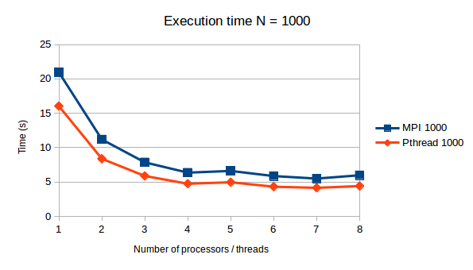
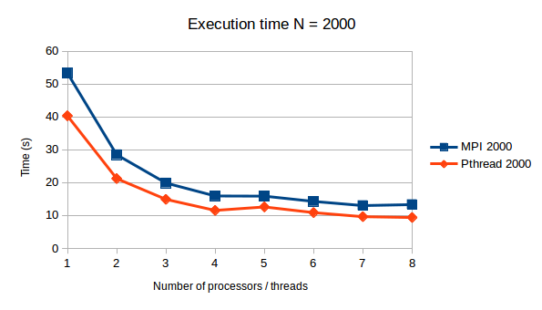
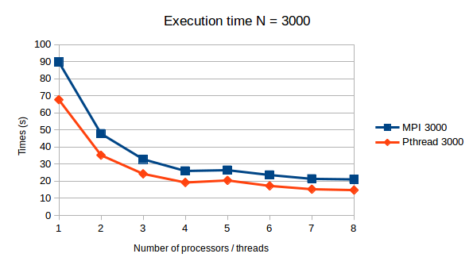
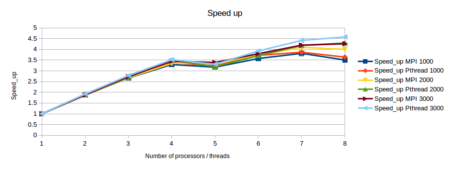
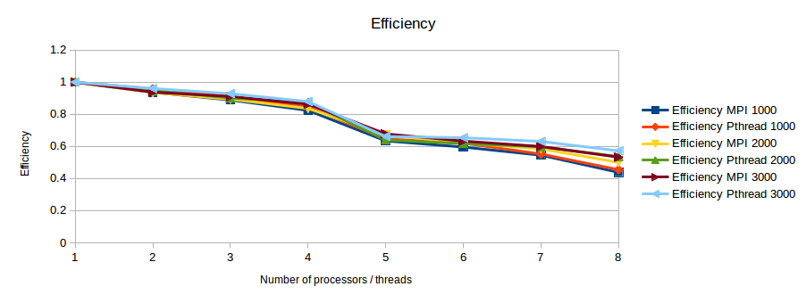
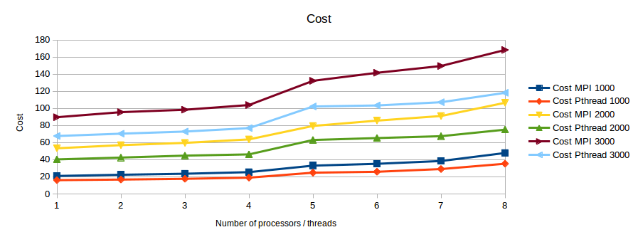

# Assignment 3


# N Body Computation


# Nama: Zixuan Yao

# Student ID: 115010267


## Objective

Write a sequential program, a P-thread, and an MPI-based parallel programs to simulate an astronomical *N*-body system, but in two-dimensions. The bodies are initially at rest. Their initial positions and masses are to be selected randomly (using a random number generator). 


## Methods & Program Design

### Sequential

The intuitive idea of simulate the astronomical N-body movement is to go through all the N bodies to calculate the gracitational force. However, this is an N^2 algorithm, when N becomes exterm large

#### *Barnes-Hut algorithm* achieved by a quadrant tree

The crucial idea in speeding up the brute force n-body algorithm is to group nearby bodies and approximate them as a single body. If the group is sufficiently far away, we can approximate its gravitational effects by using its *center of mass*. The center of mass of a group of bodies is the average position of a body in that group, weighted by mass. Formally, if two bodies have positions (`x1`, `y1`) and (`x2`, `y2`), and masses `m1` and `m2`, then their total mass and center of mass (`x`, `y`) are given by:

> m = m1 + m2
>
> x = (x1m1 + x2m2) / m
>
> y = (y1m1 + y2m2) / m

The *Barnes-Hut algorithm* is a clever scheme for grouping together bodies that are sufficiently nearby. It recursively divides the set of bodies into groups by storing them in a *quad-tree*. A quad-tree is similar to a binary tree, except that each node has 4 children (some of which may be empty). Each node represents a region of the two dimensional space.

As shown in the diagram, the bodies are allocated in the quad-tre, where the node represents a virtualbody containing the information of totalmass, center_x and center_y (center of mass). The topmost node represents the whole space, and its four children represent the four quadrants of the space. The space is recursively subdivided into quadrants until each subdivision contains at most 1 body (divide into leaf nodes) (some internal nodes have less than 4 non-empty children).


#### CONSTRUCTING THE BARNES-HUT TREE

To construct the Barnes-Hut tree, insert the bodies one after another. To insert a body *b* into the tree roote node *x*, use the following recursive procedure:

Update the center-of-mass and total mass of *x*.

1. If node *x* does not contain a body, put the new body *b* here.

2. If node *x* is an internal node. Recursively insert the body *b* in the appropriate quadrant.

3. If node *x* is an external node (leaf node), say containing a body named *c*, then there are two bodies *b* and *c* in the same region. Subdivide the region into four quadrants and move *c* to its corresponding quadrants. Then, recursively insert both *b* into the appropriate quadrant(s) until it is the only body in its quadrant. Since *b* and *c* may still end up in the same quadrant, there may be several subdivisions during a single insertion.


As an example, consider the 5 bodies in the diagram below. In our examples, we use the convention that the branches, from left to right, represent the northwest, northeast, southwest, and southeast quadrants, respectively. The tree goes through the following stages as the bodies are inserted:


​	When calculating the gravitational force exerted by other N-1 bodies on body A, we can go throw all the node (virtualbody) instead of all the N-1 bodies. If the distance between virtualbody and body A satisfies the condition: d/r < theta (usually 0.5), which means the bodies inside virtualbody is far enough from body A to be viewed as a whole, then the force exerted by all these bodies on body A can be approximately calculated by the force exerted by the virtualbody as a whole. 


#### CALCULATING THE FORCE ACTING ON A BODY

To calculate the net force acting on body *b*, use the following recursive procedure, starting with the root of the quad-tree:

1. If the current node is an external node (and it is not body *b*), calculate the force exerted by the current node on *b*, and add this amount to *b*’s net force.
2. Otherwise, calculate the ratio s/d. If s/d < θ, treat this internal node as a single body, and calculate the force it exerts on body *b*, and add this amount to *b*’s net force.
3. Otherwise, run the procedure recursively on each of the current node’s children.


As an example, to calculate the net force acting on body *a*, we start at the root node, which is an internal node. It represents the center-of-mass of the six bodies *a*, *b*, *c*, *d*, *e*, and *f*, which have masses 1, 2, 3, 4, 5, and 6 kg, respectively.

The force calculation proceeds as follows:

1. The first node examined is the root. Comparing body A to the node’s center of mass (white dot), the quotient s/d = 100/43.1 > θ = 0.5, so we perform the process recursively on each of the root’s children.

   

2. The first child is body *a* itself. A node does not exert force on itself, so we don’t do anything.

   

3. This child represents the northeast quadrant of the space, and contains the center-of-mass of bodies *b*, *c*, *d*, and *e*. Now s/d = 50/62.7 > θ so we recursively calculate the force exerted by the node’s first non-empty child.

   

4. This is also an internal node, representing the northeast quadrant of its parent, and containing the center-of-mass of bodies *b*, *c*, and *d*. Now s/d = 25/66.9 < θ. Treating the internal node as a single body whose mass is the sum of the masses of *b*, *c*, and *d*, we calculate the force exerted on body *a*, and add this value to the net force exerted on *a*. Since the parent of this node has no more children, we continue examining the other children of the root.

   

5. The next child is the one containing body *e*. This is an external node, so we calculate the pairwise force between *a* and *e*, and add this to *a*’s net force.

   

6. Having examined all the siblings at this level, we move on to the next sibling of the parent. This brings us to the node containing body *f*. Since it is an external node we calculate the pairwise force between *a* and *f*, and add this to *a*’s net force.

   


With reference to: http://arborjs.org/docs/barnes-hut

Text: adapted from [COS126: Barnes-Hut Galaxy Simulator](http://www.cs.princeton.edu/courses/archive/fall03/cs126/assignments/barnes-hut.html) (2003)

Diagrams: [Samzidat Drafting Co.](http://samizdat.cc/) (2011)


## Instruction & Results

### MPI Instruction

``` bash
$ mpicc -o mpi MPI.c -lX11 -lm
$ mpirun -np 4 mpi 
Maximum iteration: 2000.
Number of bodies: 1000.
Number of processes: 4.
The total time for calculation is 14.313400 s.
```

### Pthread Instruction

``` bash
$ gcc -o pthread Pthread.c -lpthread -lX11 -lm
$ ./pthread 4
Maximum iteration: 2000.
Number of bodies: 1000.
The total time for calculation is 10.262782 s.
```

The argument 4 is the argument to indicate how many threads you want to create.


### Result

The colorful output figure will be:


## Performance Analysis

I test the program performance by running various problem sizes on different number of processors, the running time is collected in the following figures. There are also several ways to enlarge the problem size, I select N because it is non-linear and more interesting. The speed up, efficiency and cost factor are also calculated to see the improvement more clearly.


### N = 1000



### N = 2000



### N = 3000




### Speed_ up, Efficiency and Cost









Based on the figures it can be easily observed that, the parallel program will have good performance when the problem size is large, because the Speed_up, efficiency are all largest for N = 3000, then N = 2000, then N = 1000. 

Generally, Pthread's performance is better than MPI, because share memory design does not need to communicate with each other and broadcast spends a lot of time in my MPI program. Because Pthread shares memory, thus they don't have communication overhead, which counts a significant time in the total execution time of MPI when the problem size is small. That's why we can hardly get improvement when the problem size is small and number of processors is also small.

The cluster is not stable and is unable to ultilize multiple CPU, so I run the computer on my own PC. My PC is 4 cores (8 threads, Intel Hyperthread),  which explains why there is a big drop on the performance when 5 processors / threads are used than 4. If 8 processors / threads are used, there will also be a decline in performance because the system still occupies some resources.


## Experience

1. When writing MPI program, we need to pay attention to that MPI_Bcast.

2. We also need to focus on the the time calculation in Pthread and MPI. Especially in Pthread, the clock() function will count the total time of all the threads instead of the parallel time. We should use clock_gettime(CLOCK_MONOTONIC, &finish) function instead.

3. The parallel program will give us improvement when the problem size is large. Usually, it won't perform better than the sequential program when the problem size is small.


## Appendix

### Sequential

``` c
/* Sequential N-body simulation with quadrant_tree */

#include <X11/Xlib.h>
#include <X11/Xutil.h>
#include <X11/Xos.h>
#include <stdio.h>
#include <stdlib.h>
#include <string.h>
#include <math.h>
#include <time.h>
#include "quadrant_tree.h"

#define N    1000              /* number of particles */
#define G    6                /* gravity constant 6.673e-11 */
#define timeslot 0.002        /* time slot of one movement */
#define totalstep 2000        /* total simulation time */
#define X_RESN 800            /* X resolution */
#define Y_RESN 800            /* Y resolution */

int X_L = 3*X_RESN / 8.0;     /* X lower bound for particle initial local */
int X_U = 5*X_RESN / 8.0;     /* X upper bound for particle initial local */
int Y_L = 3*Y_RESN / 8.0;     /* Y lower bound for particle initial local */
int Y_U = 5*Y_RESN / 8.0;     /* Y upper bound for particle initial local */

int X_L_M = 2*X_RESN / 8.0;   /* X lower bound for particle movement */
int X_U_M = 6*X_RESN / 8.0;   /* X upper bound for particle movement */
int Y_L_M = 2*Y_RESN / 8.0;   /* Y lower bound for particle movement */
int Y_U_M = 6*Y_RESN / 8.0;   /* Y upper bound for particle movement */

struct body * bodies;
int result[totalstep][N][3] = {0};


int main(int argc, char const *argv[])
{
    int current_step = 0;
    int i, j;
    struct timespec start_time, end_time;

    /* Initialize bodies in all processors to store N body */
    bodies = malloc(N*sizeof(struct body));
    for (i = 0; i < N; i++) {

        srand(time(0) + rand());
        bodies[i].m = rand() % (1000 - 900) + 900;

        srand(time(0) + rand());
        bodies[i].vx = 0;

        srand(time(0) + rand());
        bodies[i].vy = 0;

        srand(time(0) + rand());
        bodies[i].x = rand() % (X_U - X_L) + X_L;

        srand(time(0) + rand());
        bodies[i].y = rand() % (Y_U - Y_L) + Y_L;

        bodies[i].fx = 0;
        bodies[i].fy = 0;
        bodies[i].active = 1;

    }

    clock_gettime(CLOCK_MONOTONIC, &start_time);

    for (int current_step = 0; current_step < totalstep; current_step++) {

        struct tree * rootnode;
        double xmin = X_L_M, xmax = X_U_M, ymin = Y_L_M, ymax = Y_U_M;

        /* reset force to be 0 at every iteration */
        for (i = 0; i < N; i++) {
            if (bodies[i].active == 1) {
                bodies[i].fx = 0;
                bodies[i].fy = 0;                
            }
        }

        /* First body as root node */
        rootnode = Create_TreeNode(bodies, xmin, xmax, ymin, ymax);
        for (i = 1; i < N; i++) {
            if (bodies[i].active == 1) {
                Insert_Body(bodies+i, rootnode);
            }
        }


        for (i = 0; i < N; i++) {
            if (bodies[i].active == 1) {
                Calculate_force(rootnode, bodies+i, G, 0.5);
                /* Calculate velocity */
                bodies[i].vx += timeslot*bodies[i].fx / bodies[i].m;
                bodies[i].vy += timeslot*bodies[i].fy / bodies[i].m;
                /* Calculate position */
                bodies[i].x += timeslot*bodies[i].vx;
                bodies[i].y += timeslot*bodies[i].vy;

                /* fantan */
                if (bodies[i].x < X_L_M || bodies[i].x > X_U_M) {
                    bodies[i].vx = -bodies[i].vx;
                }

                if (bodies[i].y < Y_L_M || bodies[i].y > Y_U_M) {
                    bodies[i].vy = -bodies[i].vy;
                }
                
                result[current_step][i][0] = bodies[i].active;
                result[current_step][i][1] = (int)bodies[i].x;
                result[current_step][i][2] = (int)bodies[i].y;
            }
        }
        Destroy_Tree(rootnode);
    }

    clock_gettime(CLOCK_MONOTONIC, &end_time);

    printf("Maximum iteration: %d.\n", totalstep);
    printf("Number of bodies: %d.\n", N);
    printf("The total time for calculation is %fs.\n", (end_time.tv_sec - start_time.tv_sec) + 
                                            (end_time.tv_nsec - start_time.tv_nsec)/1000000000.0);

    Display  *disp;
	Window   win;
	XEvent   evt;
        int  scr;
        GC   gc;
	Pixmap   pm;

    disp = XOpenDisplay(NULL);
	if (disp==NULL) {
		fprintf(stderr,"Cannot open display\n");
		return 1;
	}

	scr = DefaultScreen(disp);
	win = XCreateSimpleWindow(disp,RootWindow(disp,scr),
				  10,10,X_RESN,Y_RESN,
				  1,WhitePixel(disp,scr),
				  BlackPixel(disp,scr));
	XSelectInput(disp,win,ExposureMask|KeyPressMask);
	XMapWindow(disp,win);
	gc = DefaultGC(disp,scr);
	pm = XCreatePixmap(disp,win,X_RESN,Y_RESN,DefaultDepth(disp,scr));
	XFillRectangle(disp,pm,gc,0,0,X_RESN,Y_RESN);
	XSetForeground(disp,gc,WhitePixel(disp,scr));
    
    for (i = 0; i < totalstep; i++) {
        char str[30];
        sprintf(str, "Iteration: %d", i);
        XSetForeground(disp,gc,0);
        XFillRectangle(disp,pm,gc,0,0,X_RESN,Y_RESN);
        XSetForeground(disp,gc,WhitePixel (disp, scr));
        XDrawString(disp, pm, gc, 25, 25, str, strlen(str)); 
        for (j = 0; j < N; j++) {
            if (result[i][j][0] == 1)
                XDrawPoint (disp, pm, gc, result[i][j][2], result[i][j][1]);
        }
        XCopyArea(disp,pm,win,gc,0,0,X_RESN,Y_RESN,0,0);
    }

    XFreePixmap(disp,pm);
    XCloseDisplay(disp);
    free(bodies);
    return 0;
}

```


### MPI

``` c
/* Parallel N-body simulation using MPI with quadrant_tree */

#include <X11/Xlib.h>
#include <X11/Xutil.h>
#include <X11/Xos.h>
#include <stdio.h>
#include <stdlib.h>
#include <string.h>
#include <math.h>
#include <time.h>
#include "quadrant_tree.h"
#include "mpi.h"

#define N    1000              /* number of particles */
#define G    6                /* gravity constant 6.673e-11 */
#define timeslot 0.002        /* time slot of one movement */
#define totalstep 2000       /* total simulation step */
#define X_RESN 800            /* X resolution */
#define Y_RESN 800            /* Y resolution */

int X_L = 3*X_RESN / 8.0;     /* X lower bound for particle initial local */
int X_U = 5*X_RESN / 8.0;     /* X upper bound for particle initial local */
int Y_L = 3*Y_RESN / 8.0;     /* Y lower bound for particle initial local */
int Y_U = 5*Y_RESN / 8.0;     /* Y upper bound for particle initial local */

int X_L_M = 2*X_RESN / 8.0;   /* X lower bound for particle movement */
int X_U_M = 6*X_RESN / 8.0;   /* X upper bound for particle movement */
int Y_L_M = 2*Y_RESN / 8.0;   /* Y lower bound for particle movement */
int Y_U_M = 6*Y_RESN / 8.0;   /* Y upper bound for particle movement */

struct body * bodies;
int result[totalstep][N][3] = {0};


int main(int argc, char *argv[])
{
    int i, j;
    int rank, size;
    double start_time, end_time;

    MPI_Init(&argc, &argv);
    MPI_Comm_rank(MPI_COMM_WORLD, &rank);
    MPI_Comm_size(MPI_COMM_WORLD, &size);
    MPI_Barrier(MPI_COMM_WORLD);

    /* Initialize bodies in all processors to store N body */
    bodies = malloc(N*sizeof(struct body));
    /* Master processor generate random N body */
    if (rank == 0) {
        for (i = 0; i < N; i++) {
        srand(time(0) + rand());
        bodies[i].m = rand() % (1000 - 900) + 900;

        srand(time(0) + rand());
        bodies[i].vx = 0;

        srand(time(0) + rand());
        bodies[i].vy = 0;

        srand(time(0) + rand());
        bodies[i].x = rand() % (X_U - X_L) + X_L;

        srand(time(0) + rand());
        bodies[i].y = rand() % (Y_U - Y_L) + Y_L;

        bodies[i].fx = 0;
        bodies[i].fy = 0;
        bodies[i].active = 1;
        }
    }
    /* Broadcast N body to all the processors */
    for (i = 0; i < N; i++) {
        MPI_Bcast(&(bodies[i].m), 1, MPI_DOUBLE, 0, MPI_COMM_WORLD);
        MPI_Bcast(&(bodies[i].vx), 1, MPI_DOUBLE, 0, MPI_COMM_WORLD);
        MPI_Bcast(&(bodies[i].vy), 1, MPI_DOUBLE, 0, MPI_COMM_WORLD);
        MPI_Bcast(&(bodies[i].x), 1, MPI_DOUBLE, 0, MPI_COMM_WORLD);
        MPI_Bcast(&(bodies[i].y), 1, MPI_DOUBLE, 0, MPI_COMM_WORLD);
        MPI_Bcast(&(bodies[i].fx), 1, MPI_DOUBLE, 0, MPI_COMM_WORLD);
        MPI_Bcast(&(bodies[i].fy), 1, MPI_DOUBLE, 0, MPI_COMM_WORLD);
        MPI_Bcast(&(bodies[i].active), 1, MPI_INT, 0, MPI_COMM_WORLD);
    }

    start_time = MPI_Wtime();

    for (int current_step = 0; current_step < totalstep; current_step++) {

        struct tree * rootnode;
        double xmin = X_L_M, xmax = X_U_M, ymin = Y_L_M, ymax = Y_U_M;

        for (i = 0; i < N; i++) {
            if (bodies[i].active == 1) {
                bodies[i].fx = 0;
                bodies[i].fy = 0;
            }
        }

        rootnode = Create_TreeNode(bodies, xmin, xmax, ymin, ymax);

        for (i = 1; i < N; i++) {
            if (bodies[i].active == 1) {
                Insert_Body(bodies+i, rootnode);
            }
        }

        for (i = 0; i < N; i++) {
            if (bodies[i].active == 1 && rank == i % size) {
                Calculate_force(rootnode, bodies+i, G, 0.5);
            }
        }

        for (i = 0; i < N; i++) {
            MPI_Bcast(&(bodies[i].fx), 1, MPI_DOUBLE, i % size, MPI_COMM_WORLD);
            MPI_Bcast(&(bodies[i].fy), 1, MPI_DOUBLE, i % size, MPI_COMM_WORLD);
        }

        for (i = 0; i < N; i++) {
            if (bodies[i].active == 1) {
                /* Calculate velocity */
                bodies[i].vx += timeslot*bodies[i].fx / bodies[i].m;
                bodies[i].vy += timeslot*bodies[i].fy / bodies[i].m;
                /* Calculate position */
                bodies[i].x += timeslot*bodies[i].vx;
                bodies[i].y += timeslot*bodies[i].vy;

                /* fantan */
                if (bodies[i].x < X_L_M || bodies[i].x > X_U_M) {
                    bodies[i].vx = -bodies[i].vx;
                }

                if (bodies[i].y < Y_L_M || bodies[i].y > Y_U_M) {
                    bodies[i].vy = -bodies[i].vy;
                }
                
                result[current_step][i][0] = bodies[i].active;
                result[current_step][i][1] = (int)bodies[i].x;
                result[current_step][i][2] = (int)bodies[i].y;
                
            }
        }

        Destroy_Tree(rootnode);

    }

    end_time = MPI_Wtime();

    if (rank == 0) {
        printf("Maximum iteration: %d.\n", totalstep);
        printf("Number of bodies: %d.\n", N);
        printf("Number of processes: %d.\n", size);
        printf("The total time for calculation is %f s.\n", end_time - start_time);

        Display  *disp;
        Window   win;
        XEvent   evt;
            int  scr;
            GC   gc;
        Pixmap   pm;

        disp = XOpenDisplay(NULL);
        if (disp==NULL) {
            fprintf(stderr,"Cannot open display\n");
            return 1;
        }

        scr = DefaultScreen(disp);
        win = XCreateSimpleWindow(disp,RootWindow(disp,scr),
                    10,10,X_RESN,Y_RESN,
                    1,WhitePixel(disp,scr),
                    BlackPixel(disp,scr));
        XSelectInput(disp,win,ExposureMask|KeyPressMask);
        XMapWindow(disp,win);
        gc = DefaultGC(disp,scr);
        pm = XCreatePixmap(disp,win,X_RESN,Y_RESN,DefaultDepth(disp,scr));
        XFillRectangle(disp,pm,gc,0,0,X_RESN,Y_RESN);
        XSetForeground(disp,gc,WhitePixel(disp,scr));

        for (i = 0; i < totalstep; i++) {
            char str[30];
            sprintf(str, "Iteration: %d", i);
            XSetForeground(disp,gc,0);
            XFillRectangle(disp,pm,gc,0,0,X_RESN,Y_RESN);
            XSetForeground(disp,gc,WhitePixel (disp, scr));
            XDrawString(disp, pm, gc, 25, 25, str, strlen(str)); 
            for (j = 0; j < N; j++) {
                if (result[i][j][0] == 1)
                    XSetForeground(disp,gc, 0xFFFFFF/totalstep * (totalstep - j));
                    XDrawPoint (disp, pm, gc, result[i][j][2], result[i][j][1]);
            }
            XCopyArea(disp,pm,win,gc,0,0,X_RESN,Y_RESN,0,0);
        }
        XFreePixmap(disp,pm);
	    XCloseDisplay(disp);
    }
    
    MPI_Finalize();
    free(bodies);
    return 0;
}
```


### Pthread

``` c
/* Parallel n-Body simulation using Pthread with quadrant_tree */

#include <pthread.h>
#include <stdlib.h>
#include <stdio.h>
#include <string.h>
#include <math.h>
#include <time.h>
#include <X11/Xlib.h>
#include <X11/Xutil.h>
#include <X11/Xos.h>
#include "quadrant_tree.h"

//#define Num_Pthreads 4         /* number of threads*/
#define N    1000              /* number of particles */
#define G    6                /* gravity constant 6.673e-11 */
#define timeslot 0.002        /* time slot of one movement */
#define totalstep 2000        /* total simulation step */
#define X_RESN 800            /* X resolution */
#define Y_RESN 800            /* Y resolution */

int X_L = 3*X_RESN / 8.0;     /* X lower bound for particle initial local */
int X_U = 5*X_RESN / 8.0;     /* X upper bound for particle initial local */
int Y_L = 3*Y_RESN / 8.0;     /* Y lower bound for particle initial local */
int Y_U = 5*Y_RESN / 8.0;     /* Y upper bound for particle initial local */

int X_L_M = 2*X_RESN / 8.0;   /* X lower bound for particle movement */
int X_U_M = 6*X_RESN / 8.0;   /* X upper bound for particle movement */
int Y_L_M = 2*Y_RESN / 8.0;   /* Y lower bound for particle movement */
int Y_U_M = 6*Y_RESN / 8.0;   /* Y upper bound for particle movement */

struct body * bodies;
int result[totalstep][N][3] = {0};
int Num_Pthreads;

struct thread_data
{
    int id;
    struct tree * rootnode;
};

static void *update_force(void *thread) {

    struct thread_data *my_data;
    my_data = (struct thread_data *) thread;
    int i;

    for (i = 0; i < N; i++) {
        if (bodies[i].active == 1 && my_data->id == i % Num_Pthreads) {
            Calculate_force(my_data->rootnode, bodies+i, G, 0.5);
        }
    }

}

int main(int argc, char const *argv[])
{
    sscanf(argv[1], "%d", &Num_Pthreads);
    int i, j;
    struct timespec start_time, end_time;

    /* Initialize bodies in all processors to store N body */
    bodies = malloc(N*sizeof(struct body));
    for (i = 0; i < N; i++) {

        srand(time(0) + rand());
        bodies[i].m = rand() % (1000 - 900) + 900;

        srand(time(0) + rand());
        bodies[i].vx = 0;

        srand(time(0) + rand());
        bodies[i].vy = 0;

        srand(time(0) + rand());
        bodies[i].x = rand() % (X_U - X_L) + X_L;

        srand(time(0) + rand());
        bodies[i].y = rand() % (Y_U - Y_L) + Y_L;

        bodies[i].fx = 0;
        bodies[i].fy = 0;
        bodies[i].active = 1;

    }

    clock_gettime(CLOCK_MONOTONIC, &start_time);

    for (int current_step = 0; current_step < totalstep; current_step++) {
        pthread_t threads[Num_Pthreads];
        struct thread_data td[Num_Pthreads];
        int rc;

        struct tree * rootnode;
        double xmin = X_L_M, xmax = X_U_M, ymin = Y_L_M, ymax = Y_U_M;

        /* reset force to be 0 at every iteration */
        for (i = 0; i < N; i++) {
            if (bodies[i].active == 1) {
                bodies[i].fx = 0;
                bodies[i].fy = 0;
            }
        }

        rootnode = Create_TreeNode(bodies, xmin, xmax, ymin, ymax);

        for (i = 1; i < N; i++) {
            if (bodies[i].active == 1) {
                Insert_Body(bodies+i, rootnode);
            }
        }

        for (i = 0; i < Num_Pthreads; i++) {
            td[i].id = i;
            td[i].rootnode = rootnode;
            rc = pthread_create(&threads[i], NULL, update_force, (void *)&td[i]);
            if (rc) {
                printf("Error: unable to create thread, %d\n", rc);
                exit(-1);
            }
        }

        for (i = 0; i < Num_Pthreads; i++) {
            rc = pthread_join(threads[i], NULL);
            if (rc) {
                printf("Error: unable to join thread, %d\n", rc);
                exit(-1);
            }
        }

        for (i = 0; i < N; i++) {
            if (bodies[i].active == 1) {
                bodies[i].vx += timeslot*bodies[i].fx / bodies[i].m;
                bodies[i].vy += timeslot*bodies[i].fy / bodies[i].m;

                bodies[i].x += timeslot*bodies[i].vx;
                bodies[i].y += timeslot*bodies[i].vy;

                if (bodies[i].x < X_L_M || bodies[i].x > X_U_M) {
                    bodies[i].vx = -bodies[i].vx;
                }

                if (bodies[i].y < Y_L_M || bodies[i].y > Y_U_M) {
                    bodies[i].vy = -bodies[i].vy;
                }
                
                result[current_step][i][0] = bodies[i].active;
                result[current_step][i][1] = (int)bodies[i].x;
                result[current_step][i][2] = (int)bodies[i].y;
            }
        }
        Destroy_Tree(rootnode);
    }

    clock_gettime(CLOCK_MONOTONIC, &end_time);

    printf("Maximum iteration: %d.\n", totalstep);
    printf("Number of bodies: %d.\n", N);
    printf("The total time for calculation is %f s.\n", (end_time.tv_sec - start_time.tv_sec) + 
                                            (end_time.tv_nsec - start_time.tv_nsec)/1000000000.0);

    Display  *disp;
	Window   win;
	XEvent   evt;
        int  scr;
        GC   gc;
	Pixmap   pm;

    disp = XOpenDisplay(NULL);
	if (disp==NULL) {
		fprintf(stderr,"Cannot open display\n");
		return 1;
	}

	scr = DefaultScreen(disp);
	win = XCreateSimpleWindow(disp,RootWindow(disp,scr),
				  10,10,X_RESN,Y_RESN,
				  1,WhitePixel(disp,scr),
				  BlackPixel(disp,scr));
	XSelectInput(disp,win,ExposureMask|KeyPressMask);
	XMapWindow(disp,win);
	gc = DefaultGC(disp,scr);
	pm = XCreatePixmap(disp,win,X_RESN,Y_RESN,DefaultDepth(disp,scr));
	XFillRectangle(disp,pm,gc,0,0,X_RESN,Y_RESN);
	XSetForeground(disp,gc,WhitePixel(disp,scr));
    
    for (i = 0; i < totalstep; i++) {
        char str[30];
        sprintf(str, "Iteration: %d", i);
        XSetForeground(disp,gc,0);
        XFillRectangle(disp,pm,gc,0,0,X_RESN,Y_RESN);
        XSetForeground(disp,gc,WhitePixel (disp, scr));
        XDrawString(disp, pm, gc, 25, 25, str, strlen(str)); 
        for (j = 0; j < N; j++) {
            if (result[i][j][0] == 1)
                XSetForeground(disp,gc, 0xFFFFFF/totalstep * (totalstep - j));
                XDrawPoint (disp, pm, gc, result[i][j][2], result[i][j][1]);
        }
        XCopyArea(disp,pm,win,gc,0,0,X_RESN,Y_RESN,0,0);
    }

    XFreePixmap(disp,pm);
    XCloseDisplay(disp);
    free(bodies);
    return 0;
}
```


### quadrant_tree.h

``` c
/* quadrant_tree head file */
#pragma once

/* 
0--------------------
|         |         |
|    4    |    1    |
|         |         |
|         |         |
---------------------
|         |         |
|         |         |
|    3    |    2    |
|         |         |
---------------------
*/
enum quadrant{q_1, q_2, q_3, q_4};

struct body {
    double m;      
    double x, y;    
    double vx, vy;  
    double fx, fy;
    int active;
};

struct tree {
    double totalmass;
    double centerx, centery;
    double xmin, xmax;
    double ymin, ymax;
    double xmid, ymid;
    struct body * virtualbody;
    struct tree * q_1;
    struct tree * q_2;
    struct tree * q_3;
    struct tree * q_4;
};


enum quadrant Get_Quadrant(double x, double y, double x_min, double x_max, double y_min, double y_max) {

    double x_mid, y_mid;

    x_mid = 0.5*(x_min + x_max);
    y_mid = 0.5*(y_min + y_max);

    if (x < x_mid) {
        if (y < y_mid) {
            return q_4;
        } else {
            return q_3;
        }
    } else {
        if (y < y_mid) {
            return q_1;
        } else {
            return q_2;
        }
    }
}

struct tree *Create_TreeNode(struct body * virtualbody, double xmin, double xmax, double ymin, double ymax) {

    struct tree* TreeNode;
    TreeNode = malloc(sizeof(struct tree));

    TreeNode->totalmass = virtualbody->m;
    TreeNode->centerx = virtualbody->x;
    TreeNode->centery = virtualbody->y;
    TreeNode->xmin = xmin;
    TreeNode->xmax = xmax;
    TreeNode->ymin = ymin;
    TreeNode->ymax = ymax;
    TreeNode->xmid = 0.5*(xmin + xmax);
    TreeNode->ymid = 0.5*(ymin + ymax);
    TreeNode->virtualbody = virtualbody;
    TreeNode->q_1 = NULL;
    TreeNode->q_2 = NULL;
    TreeNode->q_3 = NULL;
    TreeNode->q_4 = NULL;
    
    return TreeNode;
}

void Insert_Body(struct body * insbody, struct tree * TreeNode) {
    
    // Update_Center_Mass(TreeNode, insbody);
    TreeNode->totalmass += insbody->m;
    TreeNode->centerx = (TreeNode->totalmass*TreeNode->centerx + insbody->m*insbody->x) / (TreeNode->totalmass + insbody->m);
    TreeNode->centery = (TreeNode->totalmass*TreeNode->centery + insbody->m*insbody->y) / (TreeNode->totalmass + insbody->m);

    /* virtualbody is not virtual, stores the leaf body */
    if (TreeNode->virtualbody != NULL) {
        /* If two bodies are exactly at the same point, merge them, otherwise, the program will recursively call Insert_Body to split them (Infinite recursive cakks) */
        if (TreeNode->virtualbody->x == insbody->x && TreeNode->virtualbody->y == insbody->y) {
            TreeNode->virtualbody->m += insbody->m;
            TreeNode->virtualbody->vx = (TreeNode->virtualbody->m*TreeNode->virtualbody->vx + insbody->m*insbody->vx) / (TreeNode->virtualbody->m + insbody->m);
            TreeNode->virtualbody->vy = (TreeNode->virtualbody->m*TreeNode->virtualbody->vy + insbody->m*insbody->vy) / (TreeNode->virtualbody->m + insbody->m);
            insbody->active = 0;
        }
        else {
            /* Move the real body to its corresponding quadrant */
            enum quadrant myquad;
            myquad = Get_Quadrant(TreeNode->virtualbody->x, TreeNode->virtualbody->y, TreeNode->xmin, TreeNode->xmax, TreeNode->ymin, TreeNode->ymax);

            if (myquad ==q_4) {
                TreeNode->q_4 = Create_TreeNode(TreeNode->virtualbody, TreeNode->xmin, TreeNode->xmid, TreeNode->ymin, TreeNode->ymid);
            } 
            else if (myquad == q_1) {
                TreeNode->q_1 = Create_TreeNode(TreeNode->virtualbody, TreeNode->xmid, TreeNode->xmax, TreeNode->ymin, TreeNode->ymid);
            } 
            else if (myquad == q_3) {
                TreeNode->q_3 = Create_TreeNode(TreeNode->virtualbody, TreeNode->xmin, TreeNode->xmid, TreeNode->ymid, TreeNode->ymax);
            } 
            else {
                TreeNode->q_2 = Create_TreeNode(TreeNode->virtualbody, TreeNode->xmid, TreeNode->xmax, TreeNode->ymid, TreeNode->ymax);
            }

            TreeNode->virtualbody = NULL;
        }
    } 
    /* virtualbody is actually virtual, stores no real body */
    if (TreeNode->virtualbody == NULL) {
        enum quadrant insquad;
        insquad = Get_Quadrant(insbody->x, insbody->y, TreeNode->xmin, TreeNode->xmax, TreeNode->ymin, TreeNode->ymax);
        if (insquad == q_4) {
            if (TreeNode->q_4 == NULL) {
                TreeNode->q_4 = Create_TreeNode(insbody, TreeNode->xmin, TreeNode->xmid, TreeNode->ymin, TreeNode->ymid);
            } 
            else {
                Insert_Body(insbody, TreeNode->q_4);
            }
        } 
        else if (insquad == q_1) {
            if (TreeNode->q_1 == NULL) {
                TreeNode->q_1 = Create_TreeNode(insbody, TreeNode->xmid, TreeNode->xmax, TreeNode->ymin, TreeNode->ymid);
            } 
            else {
                Insert_Body(insbody, TreeNode->q_1);
            }
        } 
        else if (insquad == q_3) {
            if (TreeNode->q_3 == NULL) {
                TreeNode->q_3 = Create_TreeNode(insbody, TreeNode->xmin, TreeNode->xmid, TreeNode->ymid, TreeNode->ymax);
            } 
            else {
                Insert_Body(insbody, TreeNode->q_3);
            }
        } 
        else if (insquad == q_2) {
            if (TreeNode->q_2 == NULL) {
                TreeNode->q_2 = Create_TreeNode(insbody, TreeNode->xmid, TreeNode->xmax, TreeNode->ymid, TreeNode->ymax);
            } 
            else {
                Insert_Body(insbody, TreeNode->q_2);
            }
        }
    }
}

void Calculate_force(struct tree * TreeNode, struct body * bodyp, double G, double threshold) {
    double dx, dy, d, fx, fy, s;

    dx = TreeNode->centerx - bodyp->x;
    dy = TreeNode->centery - bodyp->y;
    d = sqrt(pow(dx, 2) + pow(dy, 2));
    s = TreeNode->xmax - TreeNode->xmin;

    if ((s/d < threshold || TreeNode->virtualbody != NULL) && bodyp != TreeNode->virtualbody) {

        fx = G*TreeNode->totalmass*bodyp->m*dx / pow(d+3, 3);
        fy = G*TreeNode->totalmass*bodyp->m*dy / pow(d+3, 3);

        bodyp->fx += fx;
        bodyp->fy += fy;
    } 
    else {
        if (TreeNode->q_4 != NULL) Calculate_force(TreeNode->q_4, bodyp, G, threshold);
        if (TreeNode->q_1 != NULL) Calculate_force(TreeNode->q_1, bodyp, G, threshold);
        if (TreeNode->q_3 != NULL) Calculate_force(TreeNode->q_3, bodyp, G, threshold);
        if (TreeNode->q_2 != NULL) Calculate_force(TreeNode->q_2, bodyp, G, threshold);
    }
}

void Destroy_Tree(struct tree * TreeNode) {
    if (TreeNode != NULL) {
        if (TreeNode->q_4 != NULL) Destroy_Tree(TreeNode->q_4);
        if (TreeNode->q_1 != NULL) Destroy_Tree(TreeNode->q_1);
        if (TreeNode->q_3 != NULL) Destroy_Tree(TreeNode->q_3);
        if (TreeNode->q_2 != NULL) Destroy_Tree(TreeNode->q_2);
        free(TreeNode);
    }
}
```


