# Assignment 4


# Heat Distribution


# Nama: Zixuan Yao

# Student ID: 115010267


## Objective

The temperature of the wall is 20ºC, and the temperature of the fireplace is 100ºC.  Write MPI and Pthread programs using Jacobi iteration to compute the temperature inside the room and plot (preferably in color) temperature contours at 5ºC intervals using Xlib.


## Methods & Program Design

### Methods

Jacobi Iteration to calculate heat distribute can be viewed as the following equation:
$$
\begin{align}h_{i,j}^{k} &=\frac{h_{i-1,j}^{k-1} + h_{i+1, j}^{k-1} + h_{i,j-1}^{k-1} + h_{i,j+1}^{k-1}}{4}\end{align}
$$
where k and k -1 denote the iteration. The new temperatures are calculated by the previous temperatures of the 4 adjacent pixels.

The fire is maintained as 100 degree, temperature will nor drop anyway. The room is assumed to be ideal, without any heat transferring either inside or outside. The initial temperature of the room is set to be 20.


### Program Design

#### Pthread

The pthread design is very easy. Just to call n pthreads inside each iteration and call pthread.join to synchronize the field (map of the room).


#### MPI

The MPI design is also very easy. Just to call MPI_AllGather to synchronize the field (map of the room) in each iteration and let the master to draw it.


## Instruction & Results

### Sequential Instruction

``` bash
$ gcc seq.c -o sequential -lX11
$ ./sequential 100 100 1000
The total time for calculation is 0.171041 s.
```

The first two argument 100 represents the resolution of the Heat Distribution, which is 100*100, the third argument 10000 represents the calculating iteration of the Heat Distribution.


### MPI Instruction

``` bash
$ mpicc -o mpi MPI.c -lX11
$ mpirun -np 4 mpi 100 10000
The total time for calculation is 0.779888 s.
```

The first argument 100 represents the resolution of the Heat Distribution, which is 100*100, the second argument 10000 represents the calculating iteration of the Heat Distribution.


### Pthread Instruction

``` bash
$ gcc -o pthread Pthread.c -lpthread -lX11
$ ./pthread 100 10000 4
The total time for calculation is 0.838586 s.
```

The first argument 100 represents the resolution of the Heat Distribution, which is 100*100, the second argument 10000 represents the calculating iteration of the Heat Distribution. The last 4 argument 4 is to indicate how many threads you want to create.


### Run.py Instructions for large number of experiments

``` bash
$ python3 run.py
Which program do you want to run?
	seq		MPI		Pthread		Both
> Both
How many times do you want to run?
> 10
How large is the window you want to simulate?
> 100
How many iterations do you want to run?
> 100000
How many processes/threads do you want to run?
> 4

Experiment 1
mpiexec -np 4 MS_MPI 100 100000
Finished!
The total time for calculation is 5.781513 s.
./MS_Pthread 100 100000 4
The total time for calculation is 8.444084 s.
Experiment 2
mpiexec -np 4 MS_MPI 100 100000
Finished!
The total time for calculation is 5.671878 s.
./MS_Pthread 100 100000 4
The total time for calculation is 7.500774 s.
Experiment 3
mpiexec -np 4 MS_MPI 100 100000
Finished!
The total time for calculation is 5.665157 s.
./MS_Pthread 100 100000 4
The total time for calculation is 7.689745 s.
Experiment 4
mpiexec -np 4 MS_MPI 100 100000
Finished!
The total time for calculation is 5.830582 s.
./MS_Pthread 100 100000 4
The total time for calculation is 7.576309 s.
Experiment 5
mpiexec -np 4 MS_MPI 100 100000
Finished!
The total time for calculation is 6.213745 s.
./MS_Pthread 100 100000 4
The total time for calculation is 8.747460 s.
Experiment 6
mpiexec -np 4 MS_MPI 100 100000
Finished!
The total time for calculation is 6.100898 s.
./MS_Pthread 100 100000 4
The total time for calculation is 7.982401 s.
Experiment 7
mpiexec -np 4 MS_MPI 100 100000
Finished!
The total time for calculation is 5.766399 s.
./MS_Pthread 100 100000 4
The total time for calculation is 7.825493 s.
Experiment 8
mpiexec -np 4 MS_MPI 100 100000
Finished!
The total time for calculation is 5.705907 s.
./MS_Pthread 100 100000 4
The total time for calculation is 7.854920 s.
Experiment 9
mpiexec -np 4 MS_MPI 100 100000
Finished!
The total time for calculation is 5.697534 s.
./MS_Pthread 100 100000 4
The total time for calculation is 8.106000 s.
Experiment 10
mpiexec -np 4 MS_MPI 100 100000
Finished!
The total time for calculation is 5.766730 s.
./MS_Pthread 100 100000 4
The total time for calculation is 7.976373 s.
```


### Result

The colorful output figure will be:


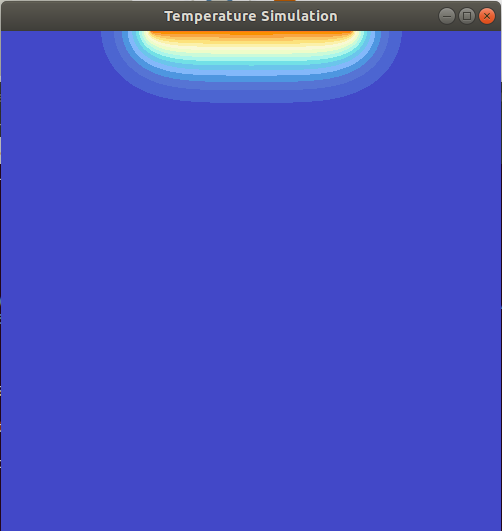

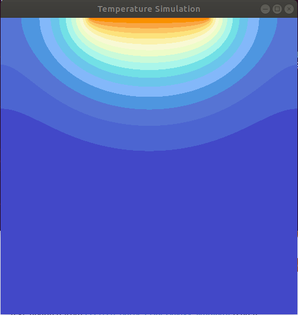

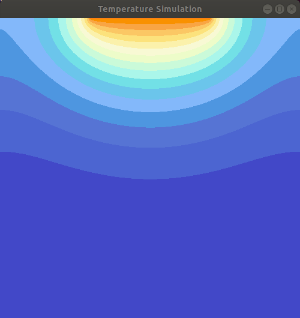


## Performance Analysis

I test the program performance by running various problem sizes on different number of processors, the running time is collected in the following figures. There are also several ways to enlarge the problem size, I select Iteration because it is linear and the actual performance can be compared with the linear argumentation baseline. The speed up, efficiency and cost factor are also calculated to see the improvement more clearly.


### Iteration = 1000

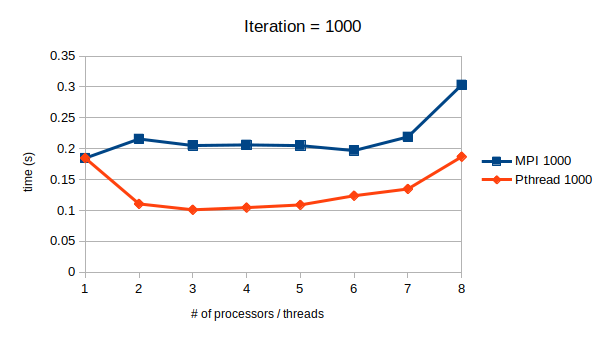


### Iteration = 10000

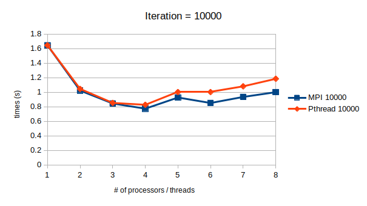


### Iteration = 100000

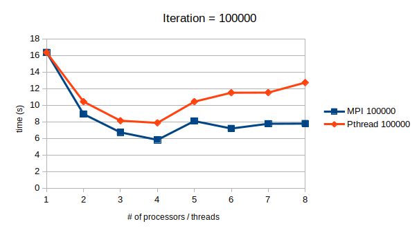


### Speed_ up

Speedup Factor can be calculated by:
$$
\begin{align}
S(n)&=\frac{Execution\ time\ using\ one\ processor}{Execution\ time\ using\ a\ multiprocessor\ with\ n\ processors}=\frac{t_s}{t_p}
\end{align}
$$
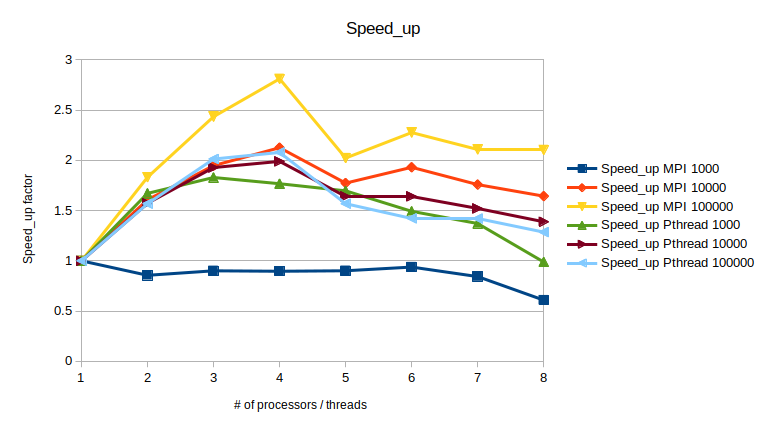

### Efficiency

Efficiency gives fraction of time that processors are being used on computation, it can be calculated by:
$$
\begin{align}
E &=\frac{Execution\ time\ using\ one\ processor}{Execution\ time\ using\ a\ multiprocessor\ \times\ number\ of\ processors}=\frac{t_s}{t_p \times n}=\frac{S(n)}{n}\times100\%
\end{align}
$$
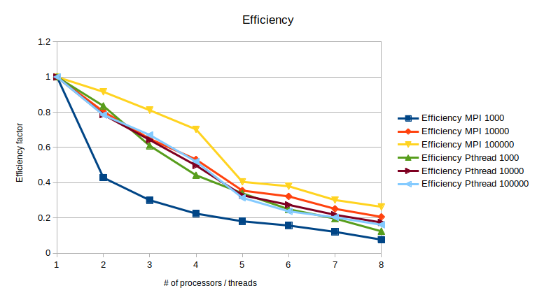


### Cost

Cost can be calculated by:
$$
\begin{align}
Cost&=(execution\ time)\times(total\ number\ of \ processors\ used)=\frac{t_sn}{S(n)}=\frac{t_s}{E}
\end{align}
$$
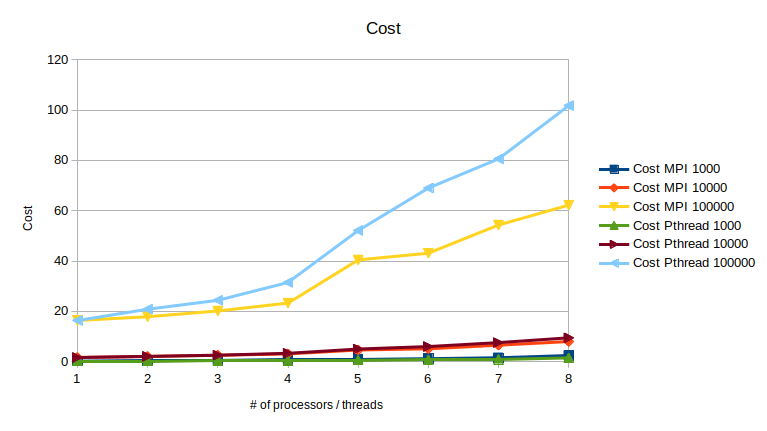


Based on the figures it can be easily observed that, the parallel program will have good performance when the problem size is large, when iteration is 10000, 100000 or larger, because the Speed_up, efficiency are all larger for Iteration = 100000 and Iteration = 10000. 

Pthread's performance is better than MPI when problem size is small (Iteration = 1000), because share memory design does not need to communicate with each other and MPI_Allgather spends a lot of time. Because Pthread shares memory, thus they don't have communication overhead, which counts a significant time in the total execution time of MPI when the problem size is small. That's why we can hardly get improvement when the problem size is small, running MPI.

The cluster is not stable, so I run the program on my own PC. My PC is 4 cores (8 threads,Intel Hyperthread), which explains why there is a big drop on the performance when 5 processors / threads are used than 4. There's hardly any improvement when running on even more processors / threads.


## Experience

1. When writing MPI program, we use MPI_Allgather and the 

2. We also need to focus on the the time calculation in Pthread and MPI. Especially in Pthread, the clock() function will count the total time of all the threads instead of the parallel time. We should use clock_gettime(CLOCK_MONOTONIC, &finish) function instead.

3. The parallel program will give us improvement when the problem size is large. Usually, it won't perform better than the sequential program when the problem size is small.

4. Interestingly, MPI generally performs better than Pthread when problem size is large (Iteration = 10000, Iteration = 100000), while Pthread performs better than MPI when problem size is small (Iteration = 1000). I tried to find out why by the system monitor.

   I found out that MPI can utilize 100% of the CPU, however, Pthread can only use around 50% of the CPU and the work load is equally distributed among 8 cores even though I only call 6 threads. That's why Pthread is slower than MPI, which may due to the system dispatch designed on my PC.


   #### MPI CPU usage

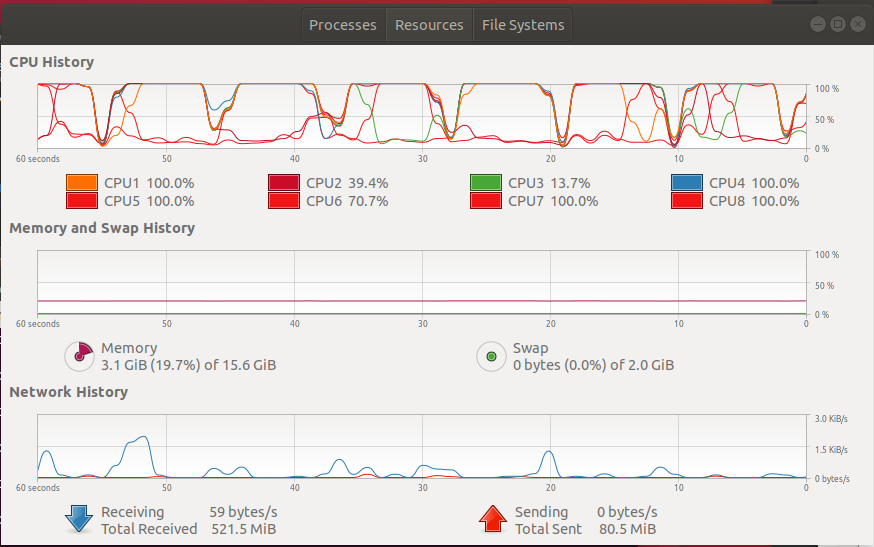

``` bash
$ mpirun -np 6 mpi 100 10000
```


#### 	Pthread CPU usage

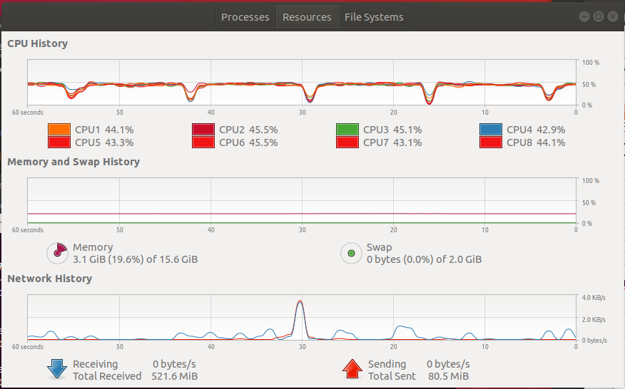

``` bash
$ ./pthread 100 10000 6
```


## Appendix (Source Code)

### Sequential

``` c
//#include "const.h"
#include "models.h"
#include "display.h"

#define legal(x, n) ( (x)>=0 && (x)<(n) )

int iteration,X,Y;
TemperatureField *field;
TemperatureField *tempField, *swapField;

int dx[4] = {0, -1, 0, 1};
int dy[4] = {1, 0, -1, 0};

TemperatureField * temperature_iterate(TemperatureField *field)
{
	int i, j, d;
	for (i=0; i<field->X_range; ++i){
		for (j=0; j<field->Y_range / 2 + 1; ++j){
			int cnt = 0;
			tempField->t[i][j] = 0;
			for (d=0; d<4; ++d){
				if ( legal(i+dx[d], field->X_range) && legal(j+dy[d], field->Y_range) ) {
					tempField->t[i][j] += field->t[i+dx[d]][j+dy[d]];
					++cnt;
				}
			}
			tempField->t[i][j] /= cnt;
			tempField->t[i][field->Y_range - j] = tempField->t[i][j];
		}	
	}
	for (j = (int)(0.3*field->Y_range); j < (int)(0.7*field->Y_range); j++){
		tempField->t[0][j] = 100.0f;
	}
	return tempField;
}

int main(int argc, char **argv)
{
    FILE *file;
	
	if (argc<4)
    {
	    printf("Usage: %s X Y iteration\n", argv[0]);
    }
    sscanf(argv[1], "%d", &X);
    sscanf(argv[2], "%d", &Y);
    sscanf(argv[3], "%d", &iteration);

    field = malloc(sizeof(TemperatureField));
    tempField = malloc(sizeof(TemperatureField));
    newField(field, X, Y,0,0);
    newField(tempField, X, Y,0,0);
    initField(field);
    XWindow_Init(field);

    struct timespec start_time, end_time;
    double totaltime;
    clock_gettime(CLOCK_MONOTONIC, &start_time);

    int iter;
    for (iter=0; iter<iteration; iter++){
		tempField = temperature_iterate(field);
		//swapField = field;
		field = tempField;
		//tempField = swapField;
		//XRedraw(field);
    }

    clock_gettime(CLOCK_MONOTONIC, &end_time);
    totaltime = (end_time.tv_sec - start_time.tv_sec) + (end_time.tv_nsec - start_time.tv_nsec) / 1000000000.0;
	char str[100];
	sprintf(str, "HD_Sequential_#x:%d_#iter:%d.txt", X, iter);
	printf("The total time for calculation is %f s.\n", totaltime);
	file = fopen(str, "a");
	fprintf(file, "%f\n", totaltime);
	fclose(file);
    return 0;
}
```


### MPI

``` c
#include "models.h"
#include "display.h"
#include <mpi.h>

int iteration, x;
TemperatureField *field;
TemperatureField *tempField, *swapField;

int dx[4] = { 0, -1, 0, 1 };
int dy[4] = { 1, 0, -1, 0 };

int size;

void temperature_iterate(int start, int size) {
	int i, j, d;
	for (i = start; i < start + size; i++) {
		if (legal(i, field->X_range)) {
			if (legal(i, field->X_range)) /* check for i over X_range */
			for (j = 0; j < field->Y_range / 2 + 1; j++) {
				int cnt = 0;
				tempField->t[i][j] = 0;
				for (d = 0; d < 4; ++d) {
					if (legal(i + dx[d], field->X_range) && legal(j + dy[d], field->Y_range)) {
						tempField->t[i][j] += field->t[i + dx[d]][j + dy[d]];
						++cnt;
					}
				}
				tempField->t[i][j] /= cnt;
				tempField->t[i][field->Y_range - j] = tempField->t[i][j];
			}
		}
	}
}

int main(int argc, char **argv){

    //XInitThreads();
	FILE * file;
	int i;

	int num_processor, rank;
	double start_time, end_time;
	start_time = MPI_Wtime();
	MPI_Init(&argc, &argv);
	MPI_Comm_size(MPI_COMM_WORLD, &num_processor);
	MPI_Comm_rank(MPI_COMM_WORLD, &rank);

    if (argc<3) {
	    printf("Usage: %s x iteration\n", argv[0]);
    }
    sscanf(argv[1], "%d", &x);
    sscanf(argv[2], "%d", &iteration);

    field = malloc(sizeof(TemperatureField));
    tempField = malloc(sizeof(TemperatureField));
    newField(field, x, x, 0, 0);
    newField(tempField, x, x, 0, 0);
    initField(field);

	if (rank == 0) {
        XWindow_Init(field);
	}

	size = (field->X_range % num_processor == 0) ? field->X_range / num_processor : field->X_range / num_processor + 1;
    int start = rank * size;
    int iter;
	for (iter = 0; iter < iteration; iter++) {
		temperature_iterate(start, size);
        MPI_Allgather(&(tempField->t[start][0]), size*field->Y_range*2, MPI_FLOAT, &(field->t[0][0]), size*field->Y_range*2, MPI_FLOAT, MPI_COMM_WORLD);

		if (rank == 0) {
            for(i = x * 0.3; i < x * 0.7; i++)
			    field->t[0][i] = FIRE_TEMP;
            XRedraw(field);
		}
	} 

    if (rank == 0) {
        end_time = MPI_Wtime();
		double totaltime = end_time - start_time;
		char str[100];
		sprintf(str, "HD_MPI_#Processor:%d_#x:%d_#iter:%d.txt", num_processor, x, iter);
		printf("The total time for calculation is %f s.\n", totaltime);
		file = fopen(str, "a");
		fprintf(file, "%f\n", totaltime);
		fclose(file);
	}
    
    MPI_Finalize();
    return 0;
}
```


### Pthread

``` c
#include "models.h"
#include "display.h"
#include <pthread.h>

int iteration, x, num_thread;
TemperatureField *field;
TemperatureField *tempField, *swapField;

int dx[4] = {0, -1, 0, 1};
int dy[4] = {1, 0, -1, 0};

int size;
pthread_t *threads;

void *temperature_iterate(void *t)
{
	int i, j, d;
	int start = (int)t;
	for (i = start; i < start + size; i++) {
		if (legal(i, field->X_range)) /* check for i over X_range */
		for (j = 0; j < field->Y_range / 2 + 1; j++) {
			int cnt = 0;
			tempField->t[i][j] = 0;
			for (d = 0; d < 4; ++d) {
				if (legal(i + dx[d], field->X_range) && legal(j + dy[d], field->Y_range)) {
					tempField->t[i][j] += field->t[i + dx[d]][j + dy[d]];
					++cnt;
                    
				}
			}
			tempField->t[i][j] /= cnt;
			tempField->t[i][field->Y_range - j] = tempField->t[i][j];
		}
	}
	//tempField->t[0][0] = 100.0f;
	// for(i = field->x * 0.3; i < field->x * 0.7; i++)
	// 	tempField->t[0][i] = 100.0f;
}

int main(int argc, char **argv)
{
    XInitThreads(); /* multiple threads draw */
    FILE *file;
    int i;

    if (argc<4)
	    printf("Usage: %s x y iteration\n", argv[0]);
    sscanf(argv[1], "%d", &x);
    sscanf(argv[2], "%d", &iteration);
	sscanf(argv[3], "%d", &num_thread);

    field = malloc(sizeof(TemperatureField));
    tempField = malloc(sizeof(TemperatureField));
    newField(field, x, x, 0, 0);
    newField(tempField, x, x, 0, 0);
    initField(field);
    XWindow_Init(field);

	struct timespec start_time, end_time;
	double totaltime;
	clock_gettime(CLOCK_MONOTONIC, &start_time);

	//threads = (pthread_t*)malloc(num_thread * sizeof(pthread_t));
	pthread_t threads[num_thread];

	size = (field->X_range % num_thread == 0) ? field->X_range / num_thread : field->X_range / num_thread + 1;

    int iter;
	for (iter = 0; iter < iteration; iter++) {

		for (i = 0; i < num_thread; i++) {
			int start = i * size;
			pthread_create(&threads[i], NULL, temperature_iterate, (void *)start);
		}

		for (i = 0; i < num_thread; i++)
			pthread_join(threads[i], NULL);

        for(i = field->X_range * 0.3; i < field->X_range * 0.7; i++)
			tempField->t[0][i] = 100;
		field = tempField;
		XRedraw(field);
	}

	clock_gettime(CLOCK_MONOTONIC, &end_time);
	totaltime = (end_time.tv_sec - start_time.tv_sec) + (end_time.tv_nsec - start_time.tv_nsec) / 1000000000.0;
	char str[100];
	sprintf(str, "HD_Pthread_#Thread:%d_#x:%d_#iter:%d.txt", num_thread, x, iter);
	printf("The total time for calculation is %f s.\n", totaltime);
	file = fopen(str, "a");
	fprintf(file, "%f\n", totaltime);
	fclose(file);

	//sleep(20);
	pthread_exit(NULL);
    return 0;
}
```


### Head files

#### const.h

``` C
#ifndef _CONST
#define _CONST

#define FRAME_INTERVAL 20
#define X_REFRESH_RATE 1000

#define ROOM_TEMP 20
#define FIRE_TEMP 100

#endif
```

#### display.h

``` c
/* Initial Mandelbrot program */


#include <X11/Xlib.h>
#include <X11/Xutil.h>
#include <X11/Xos.h>
#include <stdio.h>
#include <string.h>
#include <math.h>
#include <stdlib.h>
#include "models.h"
#include "const.h"

Window          win;                            /* initialization for a window */
unsigned
int             width, height,                  /* window size */
		border_width,                   /*border width in pixels */
		idth, display_height,  /* size of screen */
		screen;                         /* which screen */

char            *window_name = "Temperature Simulation", *display_name = NULL;
GC              gc;
unsigned
long            valuemask = 0;
XGCValues       values;
Display         *display;
XSizeHints      size_hints;
Pixmap          bitmap;
FILE            *fp, *fopen ();	
Colormap	default_cmap;
XColor		color[256];

int temperatue_to_color_pixel(double t)
{
	return color[(int)(t/5.0f) - 1].pixel;
}

void XWindow_Init(TemperatureField *field)
{    
        XSetWindowAttributes attr[1];       
       
        /* connect to Xserver */

        if (  (display = XOpenDisplay (display_name)) == NULL ) {
           fprintf (stderr, "drawon: cannot connect to X server %s\n",
                                XDisplayName (display_name) );
        exit (-1);
        }
        
        /* get screen size */

        screen = DefaultScreen (display);

        /* set window size *///XFlush (display);

        width = field->Y_range;
	    height = field->X_range;

        /* create opaque window */

        border_width = 4;
        win = XCreateSimpleWindow (display, RootWindow (display, screen),
                                width, height, width, height, border_width, 
                                BlackPixel (display, screen), WhitePixel (display, screen));

        size_hints.flags = USPosition|USSize;
        size_hints.x = 0;
        size_hints.y = 0;
        size_hints.width = width;
        size_hints.height = height;
        size_hints.min_width = 300;
        size_hints.min_height = 300;
        
        XSetNormalHints (display, win, &size_hints);
        XStoreName(display, win, window_name);

        /* create graphics context */

        gc = XCreateGC (display, win, valuemask, &values);

	default_cmap = DefaultColormap(display, screen);
        XSetBackground (display, gc, WhitePixel (display, screen));
        XSetForeground (display, gc, BlackPixel (display, screen));
        XSetLineAttributes (display, gc, 1, LineSolid, CapRound, JoinRound);

        attr[0].backing_store = Always;
        attr[0].backing_planes = 1;
        attr[0].backing_pixel = BlackPixel(display, screen);

        XChangeWindowAttributes(display, win, CWBackingStore | CWBackingPlanes | CWBackingPixel, attr);

        XMapWindow (display, win);
        XSync(display, 0); 

	/* create color */
    int red[25] = {51, 70, 84, 67, 77, 87, 79, 132, 108, 115, 171, 203, 238, 249, 252, 253, 252, 250, 250, 255, 240, 247, 252, 231};
    int green[25] = {13, 33, 64, 73, 102, 117, 151, 185, 198, 225, 247, 251, 253, 250, 242, 227, 200, 166, 146, 121, 93, 79, 38, 0};
    int blue[25] = {128, 146, 182, 201, 210, 213, 225, 251, 236, 231, 235, 218, 202, 213, 172, 125, 101, 68, 0, 26, 4, 20, 3, 0};
	int i;
	for (i=0; i<20; ++i)
	{
	    color[i].green = green[i] * 255;
	    color[i].red = red[i] * 255;
	    color[i].blue = blue[i] * 255;
	    color[i].flags = DoRed | DoGreen | DoBlue;
	    XAllocColor(display, default_cmap, &color[i]);
	}
}

void XResize(TemperatureField *field)
{
    XResizeWindow(display, win, field->Y_range, field->X_range);
}

void XRedraw(TemperatureField *field)
{
    int i, j;
    for (i=0; i<field->X_range; ++i)
        for (j=0; j<field->Y_range; ++j)
	{
		XSetForeground(display, gc, temperatue_to_color_pixel(field->t[i][j]));
	        XDrawPoint (display, win, gc, j, i);
	}
    XFlush (display);
}
```

#### models.h

``` C
#ifndef _MODELS
#define _MODELS

#include <memory.h>
#include <stdlib.h>
#include "const.h"

#define legal(x, n) ( (x)>=0 && (x)<(n) )

typedef struct TemperatureField
{
	int X_range, Y_range;
	double **t;
	double *storage;
}TemperatureField;

void deleteField(TemperatureField *field);

void newField(TemperatureField *field, int X_range, int Y_range, int sourceX, int sourceY)
{
	TemperatureField temp = *field;
	field->storage = malloc( sizeof(double) * X_range * Y_range );
	field->t = malloc( sizeof(double*) * X_range );
	field->X_range = X_range;
	field->Y_range = Y_range;
	int i, j;
	for (i=0; i<X_range; ++i)
		field->t[i] = &field->storage[i*Y_range];
	if (sourceX)
	{
		double scaleFactorX = (double)sourceX/X_range;
		double scaleFactorY = (double)sourceY/Y_range;
		for (i=0; i<X_range; ++i)
			for (j=0; j<Y_range; ++j)
				field->t[i][j] = temp.t[(int)(i*scaleFactorX)][(int)(j*scaleFactorY)];
		deleteField(&temp);
	}
	else memset(field->storage, 0, sizeof(double)*X_range*Y_range); /* memory set storage to be all 0 */
}

void initField(TemperatureField *field)
{
	int i, j;
	for (i=0; i<field->X_range; ++i)
		for (j=0; j<field->Y_range; ++j)
			field->t[i][j] = 20.0f;
}

void refreshField(TemperatureField *field, int initX, int initY, int thisX, int thisY, int allX, int allY){
	int j;
	for (j=allY*3/10; j<allY*7/10; ++j)
	    if (legal(-initX, thisX)&&legal(j-initY, thisY))
		field->t[-initX][j-initY] = 100.0f;
}

/*
TemperatureField* myClone(TemperatureField *field, int X, int Y)
{
	int i, j;
        TemperatureField *ret = malloc(sizeof(TemperatureField));
	ret->x = X;
	ret->y = Y;
	ret->storage = malloc(sizeof(double)*ret->x*ret->y);
	ret->t = malloc(sizeof(double*)*ret->x);
	for (i=0; i<ret->x; ++i)
		ret->t[i] = &ret->storage[i*ret->y];
	for (i=0; i<X; ++i)
		for (j=0; j<Y; ++j)
			ret->t[i][j] = field->t[i][j];
	return ret;
}
*/
void deleteField(TemperatureField *field)
{
	free(field->t);
	free(field->storage);
	//free(field);
}

#endif
```


### run.py

``` python
import subprocess
import time
import os

program = str(input("Which program do you want to run?\n\tseq\t\tMPI\t\tPthread\t\tBoth\n> "))
times = int(input("How many times do you want to run?\n> "))
X_RESN = str(input("How large is the window you want to simulate?\n> "))
iteration = str(input("How many iterations do you want to run?\n> "))
num_workers = str(input("How many processes/threads do you want to run?\n> "))
10
'''load_command = "module load openmpi-3.1.2-gcc-8.2.0-qgxgzyn"'''
MPI_run_command = "mpiexec -np " + num_workers + " MS_MPI" + " " + X_RESN + " " + iteration 
print (MPI_run_command)
Pthread_run_command = os.path.join(".", "MS_Pthread") + " " + X_RESN + " " + iteration + " " + num_workers
Sequential_run_command = os.path.join(".", "MS_sequential") + " " + X_RESN + " " + X_RESN + " " + iteration
    
if(program == "MPI"):
    MPI_file_name = str("MPI.c") 
    '''str(input("The MPI program that you want to execute (with extension):\n> ") or "MPI_mandelbrot_set.c") '''
    MPI_compile_command = "mpicc -o MS_MPI " + MPI_file_name + " -lX11"
    '''subprocess.call(load_command, shell=True)'''
    subprocess.call(MPI_compile_command, shell=True)
    for i in range(times):
        print("Experiment " + str(i + 1))
        print(MPI_run_command)
        subprocess.call(MPI_run_command, shell=True)
        time.sleep(1)
elif (program == "Pthread"):
    Pthread_file_name = str("Pthread.c")
    '''str(input("The Pthread program that you want to execute (with extension):\n> ") or "Pthread_mandelbrot_set.c") '''
    Pthread_compile_command = "gcc -o MS_Pthread " + Pthread_file_name + " -lpthread -lX11"
    subprocess.call(Pthread_compile_command, shell=True)
    for i in range(times):
        print("Experiment " + str(i + 1))
        print(Pthread_run_command)
        subprocess.call(Pthread_run_command, shell=True)
        time.sleep(1)
elif (program == "seq"):
    Sequential_file_name = str("seq.c")
    '''str(input("The Pthread program that you want to execute (with extension):\n> ") or "Pthread_mandelbrot_set.c") '''
    Sequential_compile_command = "gcc -o MS_sequential " + Sequential_file_name + " -lX11"
    subprocess.call(Sequential_compile_command, shell=True)
    for i in range(times):
        print("Experiment " + str(i + 1))
        print(Sequential_run_command)
        subprocess.call(Sequential_run_command, shell=True)
        time.sleep(1)
elif (program == "Both"):
    MPI_file_name = str("MPI.c") 
    '''str(input("The MPI program that you want to execute (with extension):\n> ") or "MPI_mandelbrot_set.c") '''
    Pthread_file_name = str("Pthread.c")
    '''str(input("The Pthread program that you want to execute (with extension):\n> ") or "Pthread_mandelbrot_set.c") '''
    MPI_compile_command = "mpicc -o MS_MPI " + MPI_file_name + " -lX11"
    Pthread_compile_command = "gcc -o MS_Pthread " + Pthread_file_name + " -lpthread -lX11"
    '''subprocess.call(load_command, shell=True)'''
    subprocess.call(MPI_compile_command, shell=True)
    subprocess.call(Pthread_compile_command, shell=True)
    for i in range(times):
        print("Experiment " + str(i + 1))
        print(MPI_run_command)
        subprocess.call(MPI_run_command, shell=True)
        time.sleep(0.1)
        print(Pthread_run_command)
        subprocess.call(Pthread_run_command, shell=True)
        time.sleep(0.1)
```
